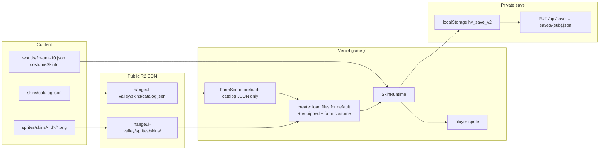

# Character Skin Catalog and Farmer Art Rebuild

| Field | Value |
|---|---|
| **Author** | Grok Systems Architect |
| **Date** | 2026-08-19 |
| **Status** | Approved |
| **Repo** | `C:\VibeCode\Hangeul Valley` (`daveynfts/Hangeul-Valley`) |
| **Stack** | Phaser 3, vanilla JS, no bundler. `game.js` / `index.html` on Vercel. Sprites/content on public CDN `cdn.daveynfts.com/hangeul-valley/`. Player saves in `localStorage` `hv_save_v2` and private R2 `saves/{sub}.json` via `/api/save`. |
| **Art source of truth** | `farm-pixel-props` (git: `.grok/skills/farm-pixel-props/SKILL.md`; generate: `C:\Users\caokh\.grok\skills\farm-pixel-props\SKILL.md`). Character-set facts (walk dirs, frame count, shared canvas) live in that skill. Agent-bundled `game-asset-core` / `game-character-consistency` / `game-animation-frames` are **not** in this repo — do not send implementers there. |

**Implementation status (2026-08-20).** The `assets/` mirror is retired; writes go to repo root only (`writeJson`, not `writeBoth`). Art library catalog is `sprites/catalog.json`. Product skin catalog is `skins/catalog.json` (farmer HD at `characters/valley-farmer/`, chef still `art: matrix`). Save schema is **v9** (`equippedSkinId` / `ownedSkinIds`). Farm overlay is `costumeSkinId` on the world JSON via `farmCostumeSkinId(callingScene)` — `_unit10Skin` is gone. Minigames use `sceneFit: 'minigame'` (matrix 48 px). Local admin **Characters** tab previews walk and opens `?debug=skins&skin=<id>` (localhost only; never PUT `/api/save`). Shop Skins UI is still deferred. Phaser preload appends `?v=` from `ART_CACHE_KEY` (must match catalog `cacheKey`; CI + `test_farm_hero.js`). Remaining work: HD chef PNGs (content), Phase 4 split `game.js`, Phase 5 deploy.

**Numbers in this document are a design snapshot.** Pipeline constants that already live in `farm-pixel-props` (magenta key, 2 px pad, height classes for stations/crops/landmarks, origin `(0.5, 1)` for planted props, `process_prop.py`) are not restated. This document adds only character-set facts and points at that skill for camera / key / process.

---

## Overview

The farm now speaks a front-facing 16-bit PNG language (desk, kitchen, stall, crops, apple tree). The player does not. `PixelArtRenderer._genPlayerTextures` still paints a 16×16 letter-matrix walk cycle, then `FarmScene._createPlayer` scales it 1.8×. Unit 10 fakes a second “skin” by re-tinting the same matrices as `chef_*` and swapping via `_unit10Skin()`. The shop sells level packs and plot expansions only. `collectSave()` has no equipped-skin field. There is no catalog, so every new outfit would become another `if` in `game.js`.

This design introduces a data-driven **skin catalog** (`skins/catalog.json`) with unlock/price metadata, save fields `equippedSkinId` / `ownedSkinIds` on the existing cloud blob, and a single runtime helper that resolves `prefix + '_' + state + '_' + dir + '_' + frame`. The current yellow-chassis farmer is torn down to a missing-file matrix fallback; a new PNG farmer is authored on the same Imagine → magenta key → `process_prop.py` pipeline as the farm props. Chef becomes catalog skin `chef` plus an optional **world costume overlay**, not a special case in `syncUnit10World`. Testers switch skins in the **local admin Characters tab**. Shop UI is **deferred** until the user asks; the catalog still carries `price` + `currency` (draft: gems). No IAP.

**Sản phẩm (ngắn):** Hệ thống nhân vật để test skin trong admin trước; chưa bán trong shop. Làm lại nông dân cho khớp art 16-bit nhìn thẳng của farm (bàn, bếp, quán, cây). Chef không còn là if/else Unit 10. Catalog JSON, lưu `equippedSkinId` / `ownedSkinIds` cùng cloud save.

---

## Background & Motivation

### Current player (verified in `game.js`)

| Fact | Location |
|---|---|
| Procedural letter-matrix farmer, palette `P` (“Industrial Yellow Farmer Pixel Robot”) | `PixelArtRenderer._genPlayerTextures` ~L1794 |
| Texture keys `player_walk_{down\|up\|left\|right}_{0\|1\|2}` | L2316–2327 |
| Action keys `player_water_down_*`, `player_harvest_down_*`, `player_pick_down_*` (down only) | L2329–2337 |
| Chef = same matrices, white/red palette `CHEF`, keys `chef_walk_*` | L2349–2364 |
| Anims `player-walk-{dir}` / `chef-walk-{dir}`, 4-frame cycle `0,1,0,2` at 8 fps | L2374–2381 |
| One-shot `player-water` / `player-harvest` / `player-pick` | L2388–2390 |
| Farm spawn: `player_walk_down_0`, scale **1.8**, body `24×16` offset `(12, 32)`, shadow `58×18`, lantern | `FarmScene._createPlayer` L10637–10649 |
| Walk uses `_unit10Skin()` for both anim key and idle texture | `update` L10711–10748 |
| Idle always snaps to `{skin}_walk_down_0` (facing is discarded) | L10742, L10748 |
| Dust puff still hardcodes `'player-walk-left'` / `'player-walk-right'` | L10730 |
| Unit 10 auto-chef | `_unit10Skin` L10938–10940: `this._isUnit10() ? 'chef' : 'player'` |
| `syncUnit10World` writes chef/player texture on the live sprite | L10950–10951 |
| Dungeon / fishing hardcode `player_walk_down_0` and `player-walk-*` | `DungeonScene` L12085, L12166–12176; `FishingScene` L12557 |
| Arcade / Bee scenes do not walk the farmer | `ArcadeScene`, `BeeScene` |
| Matrix cell is 16×16 at `ps = 3` → **48 px** source. On-screen with scale 1.8 → **~86 px**. Origin default `(0.5, 0.5)`. |

`STARDEW_PALETTE` already has a unused human outfit (skin, straw hat, overalls, boots) at L322–349. The matrix farmer does not use it; it is a yellow robot. The farm HD props do use the wood/outline half of that palette.

### Current shop and currencies

`buildShopGrid` (L7388) renders two sections into `#shop-level-grid`: plot expansions (`buyPlotExpansion`) and vocab packs (`buyLevel` → `startShopQuizGate`). Both spend **coins** via `spendCoins`. Gems and honor already exist on `playerCurrencies` (`coins` / `gems` / `honor`), HUD chips `#hud-gems` / `#hud-honor`, and helpers `spendGems` / `addGems` / `addHonor`. Gems drop from harvests, dungeon, fishing, quests; honor from cooking, quests, dungeon. **Neither currency is a shop SKU today.** No IAP. No cosmetics category.

### Current save

`collectSave()` (L5002) writes schema `v: 8` with currencies, levels, plots, SRS, cooking, `updatedAt: Date.now()`. No `equippedSkinId`, no `ownedSkinIds`. `applySave` → `migrateSaveData` (steps v4 economy, v5–v6 SRS, v7–v8 headword renames). `flushSave` writes `localStorage['hv_save_v2']`, optional pywebview file, and `pushCloudSave` → `PUT /api/save`. Cloud merge is `updatedAt` greater-or-equal wins (`syncCloudSave` L5234–5241). `/api/save` stores **private** R2 `saves/{sub}.json` (`api/_r2.js` `saveKey`). Public CDN must never receive player saves.

### Current art pipeline (do not fork)

Farm props: Imagine `1:1` magenta `#FF00FF` → `image_edit` variants from one parent → `scripts/process_prop.py --height <class>` writes `sprites/<name>.png` **and** `assets/sprites/<name>.png`. Phaser `load.image('*_hd', 'sprites/....png')` only for files that exist; spawn prefers `textures.exists(hd)` (`cropTex`, `appleTreeTex`, `_spawnUnit10Station`). Matrix keys remain missing-file fallback. `scripts/upload_r2.js` `FILES` is an explicit prod allowlist under prefix `hangeul-valley/` (`skip missing` if a listed path is absent). `/sprites/*` Cache-Control is `max-age=86400`. R2 JSON is `public, max-age=60` (no SWR); `vercel.json` adds SWR for `/worlds/`. `validate_content.js` asserts root ↔ `assets/` lockstep for listed JSON and **top-level** `sprites/*.png` only (`listPng` does not recurse today). No Vietnamese in `game.js` / `index.html`.

Unit 10 404 lesson (tightened): `sprites/unit10_stool.png` and `unit10_crate.png` exist on disk (root and `assets/`) but are **not** in `FILES` and are **not** referenced in `game.js`. The rule is: never `load.image` a file that is not on the allowlist. Phaser will still enter `create()` after a 404, but the console fills, Vercel/CDN may cache the miss, and `textures.exists` stays false. Skins follow the same rule — never probe N optional URLs. `/sprites/:path*` already rewrites `sprites/skins/**`; only `skins/catalog.json` needs a new rewrite.

### Pain points

1. Farmer reads as a different game than the desk/kitchen/stall.
2. Chef is a palette swap plus a world `if`, not a product object you can test or sell.
3. Adding a third outfit means forking `_unit10Skin`, anim registration, dungeon/fishing, and save.
4. Shop has no cosmetic slot, but currencies for a later slot already exist.
5. There is no previewer, so art QA happens by launching the full farm.

---

## Goals & Non-Goals

### Goals

1. One JSON catalog of skins. Adding a skin is a content PR (JSON + PNGs + `upload_r2.js` line), not a `game.js` rewrite.
2. Equip / unlock / save: `equippedSkinId`, `ownedSkinIds` on the same blob as today. Default farmer always owned.
3. Runtime resolves textures as `prefix + '_' + state + '_' + dir + '_' + frame`. No per-skin `if/else`.
4. Load only files the catalog says exist. Two-wave FarmScene load: catalog JSON first, then `files[]` for default + equipped + farm costume (not all 20). Never probe optional URLs.
5. Local admin Characters tab to swap skins and play walk 4-dir + idle without buying. Official tester switcher.
6. Catalog carries `price` + `currency` now (draft gems). **No shop Skins category until the user asks.** No IAP.
7. Rebuild the default farmer as HD PNGs on `farm-pixel-props`. Matrix remains fallback only.
8. Chef is catalog skin `chef`. `syncUnit10World` stops owning the outfit.
9. Scale to ~20 skins without new code paths.
10. PR-sized rollout (catalog/save/equip → farmer art → chef art → **admin switcher** → shop UI only when asked).

### Non-Goals

- Real-money IAP, Stripe, or Google Play Billing.
- Wardrobe UI in the shipped HUD. Shop Skins category is deferred until the user asks.
- Per-skin 4-dir action sets (water / harvest / pick) in v1.
- Layered equipment (hat + shirt + tool as separate sprites). One skin = one character bitmap.
- NPC skins (cat, wizard, shop sign).
- Deleting the Valley farm, portal, pond, or Unit 10 stations.
- Putting player saves on public R2 / CDN.
- Vietnamese copy in `game.js` / `index.html` (CI: `scripts/validate_content.js` `VIETNAMESE` regex).
- A second processing script that fights `process_prop.py`.
- Rewriting Arcade / Bee (they do not draw the farmer).

---

## Key Decisions (rationale)

1. **Catalog is data, runtime is one helper.** `skins/catalog.json` is the source of truth for id, price, unlock, files, and Phaser prefix. `game.js` holds `SKIN_CATALOG_DEFAULT` as a **matrix-only** cache-miss fallback (same pattern as `UNIT10_LAYOUT_DEFAULT`). DEFAULT stays `art: matrix` / `files: []` forever so a new HD skin is JSON+PNG+`FILES`, not a `game.js` rewrite. CI locks DEFAULT **ids + matrixPrefix + defaultSkinId** to the catalog; it does not require DEFAULT `art`/`files[]` to match HD rows.

2. **`id` ≠ texture prefix during the transition.** Catalog id `farmer` is stable for save/shop. Phaser prefix stays `player` / `chef` until HD files land, then HD keys become `{id}_walk_...` with `matrixPrefix` pointing at the old matrices. This lets PR1 ship save+equip against current keys.

3. **World costume overlay is FarmScene-only, not a hardcoded chef swap.** A world may declare `costumeSkinId`. The farm sprite uses it only when the **calling scene’s** key is `FarmScene`. Do **not** read global `sceneRef` for this: portal/dock `pause` FarmScene and `launch` Dungeon/Fishing (`game.js` ~L11170–11186); `sceneRef` stays the FarmScene instance until `shutdown` (~L11560), which does not run on pause. Dungeon and fishing always use `equippedSkinId` (today they ignore `_unit10Skin()`). Thread `activeSkinId(scene)` / `farmCostumeSkinId(scene)` and pass `this`. Chef remains a shop-able catalog row so it can be worn in Valley / dungeon / fishing after purchase. Unit 10 farm looks like a chef even if the player never bought the skin.

4. **Default farmer is always owned. Keep unknown `ownedSkinIds`; never persist-away an owned equipped id the catalog has not loaded yet.** Drawing falls back to farmer via `getSkinDef` (strict). `sanitizeSkinState` writes `equippedSkinId = 'farmer'` **only** if the string is empty or **unowned**. An owned but catalog-unknown id (`hanbok` on a DEFAULT-only cache) stays in memory and in `collectSave`. When the live catalog arrives, the sprite switches without a re-grant.

5. **HD farm character: height 80, scale `+1` (never negative), origin `(0.5, 1)`.** Current farm on-screen size is 48×1.8 ≈ 86 px. Accent props are 64; stations are 156. Matrix farm fallback keeps today’s 1.8 / origin 0.5 / body `24×16`. **First spawn is a special case:** matrix center stays `(W/2, H-80)` (today’s `_createPlayer`); today’s feet are `FARM_FEET_Y = H - 80 + 48 * 1.8 / 2` (`H - 37`). HD farm sets `sprite.y` to that constant once. Later swaps preserve `playerFeetY` measured **after** the live contract is on the sprite. **Minigames always prefer `matrixPrefix` 48 px frames** (`sceneFit: 'minigame'`), even if farm HD keys sit in the global texture cache. Do not scale HD to 80 in dungeon/fishing in v1.

6. **v1 animation set is walk 4-dir × 3 frames. Idle is derived: walk frame 0 of last facing.** Matches existing `0,1,0,2` at 8 fps. Catalog `states.idle` is omitted or `{ derived: "walk/0" }` — no `idle_*.png`. Actions stay on the default farmer’s current one-shot keys (or the already-coded squash tween if the key is missing). Dedicated idle sheets and 4-dir tools are a later content PR.

7. **Authoring is `farm-pixel-props` plus an in-skill character-set section, not a new pipeline.** Parent PNG via `image_gen`; turnarounds via `image_edit` from that parent; walk via in-place video then harvest three loopable frames (or `image_edit` keyframes if video drifts). Every frame through `process_prop.py --height 80 --subdir skins/<id>`, then pad the set to a **shared canvas** (max width, height 80, feet last row, torso X centered). Magenta / pad / lockstep stay in the existing skill. Do not point implementers at bundled skills that are not in this repo.

8. **Load allowlist = live catalog `files[]`, after a two-wave FarmScene load.** Preload fetches only `skins/catalog.json` (+ existing farm props). `create()` reads the cache, queues `files[]` for default + equipped + farm costume, `this.load.start()`, and (re)applies the sprite on `complete`. Matrix is an acceptable first frame. Never `load.image` a skin file that is not in the catalog and not in `upload_r2.js`. `/sprites/:path*` already rewrites `sprites/skins/**`; only the catalog JSON needs a new `/skins/` rewrite.

9. **Admin-first testing. No shop wardrobe.** Official tester switcher is the local Express **Characters** tab (equip without purchase, walk 4-dir + idle). It never writes `/api/save`. Optional localhost `?debug=skins` may remain as a farm-in-place aid during plumbing; it does not grant `ownedSkinIds`. Production cannot grant paid skins.

10. **Skins ride the existing save blob.** New fields inside `collectSave` / `applySave`. Schema bump `v: 8` → `v: 9` in `migrateSaveData` is **field-fill only** (no catalog calls). `sanitizeSkinState` in `applySave` (and when JSON arrives) only resets equipped if empty/unowned. Cloud conflict rule unchanged (`updatedAt`). No new endpoint.

11. **Shop is catalog-ready, UI deferred.** Every row has `price` and `currency`. Catalog draft uses **gems** (coins stay packs/plots; honor stays prestige). `buildShopGrid` does **not** grow a Skins section until the user asks for shop. Admin switcher ships first.

12. **CDN path `hangeul-valley/sprites/skins/<id>/` + catalog JSON `hangeul-valley/skins/catalog.json`.** New filenames, not in-place replace of matrix-named keys. `?v=` from catalog `cacheKey` beats `/sprites/*` `max-age=86400`.

---

## Proposed Design

### Architecture



### Catalog model

New file `skins/catalog.json`, mirrored to `assets/skins/catalog.json`. Vercel rewrite:

```json
{ "source": "/skins/:path*", "destination": "https://cdn.daveynfts.com/hangeul-valley/skins/:path*" }
```

Header: same as other JSON (`max-age=60, stale-while-revalidate=600`). `upload_r2.js` adds `['skins/catalog.json', 'application/json']`.

Schema (v1):

```json
{
  "version": 1,
  "cacheKey": "skins-20260819a",
  "defaultSkinId": "farmer",
  "skins": [
    {
      "id": "farmer",
      "nameEn": "Valley Farmer",
      "rarity": "common",
      "price": 0,
      "currency": "coins",
      "unlock": { "type": "default" },
      "art": "matrix",
      "matrixPrefix": "player",
      "files": [],
      "preview": null,
      "states": {
        "walk": { "dirs": ["down", "up", "left", "right"], "frames": 3 },
        "idle": { "derived": "walk/0" }
      }
    },
    {
      "id": "chef",
      "nameEn": "Kitchen Chef",
      "rarity": "uncommon",
      "price": 40,
      "currency": "gems",
      "unlock": { "type": "shop" },
      "art": "matrix",
      "matrixPrefix": "chef",
      "files": [],
      "preview": null,
      "worldCostumeOf": ["2b-unit-10"]
    }
  ]
}
```

Field rules:

| Field | Rule |
|---|---|
| `id` | `[a-z][a-z0-9_]{1,31}`. Stable forever. Saved. |
| `nameEn` | English only. CI Vietnamese regex on this file. |
| `rarity` | `common` \| `uncommon` \| `rare` \| `legendary` (display; no drop table). |
| `price` | Integer ≥ 0. `0` + `unlock.type: default` is the free farmer. |
| `currency` | `coins` \| `gems` \| `honor`. Shop PR switches on this; v1 ignores it at runtime. |
| `unlock.type` | `default` \| `shop` \| `worldVisit` \| `debug`. Unknown → treat as `shop` (not owned). |
| `art` | `matrix` \| `hd`. Only `hd` rows are `load.image`’d. |
| `matrixPrefix` | Existing `PixelArtRenderer` family. Required while `art` is `matrix`; kept as fallback after HD. |
| `files` | Basenames under `sprites/skins/<id>/`. **Allowlist.** Empty when `art: matrix`. |
| `preview` | Basename or `null` (then use `walk_down_0`). Never a required `load.image` unless listed in `files[]`. |
| `states` | Optional. **Default when omitted:** walk 4-dir × 3. `idle` is derived (`walk/0`) and must not require a file. Missing dir/frame → skip, do not 404. |
| `worldCostumeOf` | Worlds that overlay this skin **on FarmScene**. Informational; the world JSON is authoritative. |

Adding a skin later is: new folder + PNG set, one catalog object, explicit `FILES` lines, `cacheKey` bump. Zero `game.js` branches. HD files load in the **second** FarmScene wave from the live catalog, so `SKIN_CATALOG_DEFAULT` does not need those `files[]`.

In-JS fallback (cache miss / before JSON arrives), next to `UNIT10_LAYOUT_DEFAULT`:

```js
const SKIN_DEFAULT_ID = 'farmer';
const SKIN_CATALOG_DEFAULT = { /* farmer + chef rows, always art: 'matrix', files: [] */ };
function getSkinCatalog() {
  try {
    if (sceneRef && sceneRef.cache.json.exists('skin-catalog')) {
      return sceneRef.cache.json.get('skin-catalog') || SKIN_CATALOG_DEFAULT;
    }
  } catch (e) {}
  return SKIN_CATALOG_DEFAULT;
}
function getSkinDef(id) {
  const pack = getSkinCatalog();
  return (pack.skins || []).find(s => s && s.id === id); // undefined if unknown
}
function getSkinDefOrDefault(id) {
  return getSkinDef(id) || getSkinDef(SKIN_DEFAULT_ID);
}
function skinStates(def) {
  const walk = (def && def.states && def.states.walk)
    ? def.states.walk
    : { dirs: ['down', 'up', 'left', 'right'], frames: 3 };
  return { walk, idle: { derived: 'walk/0' } };
}
```

`FarmScene.preload` loads **only** `this.load.json('skin-catalog', 'skins/catalog.json?v=' + SKIN_CATALOG_BOOT_V);` (plus existing prop images). Boot token bumped when the catalog JSON URL itself changes (same pattern as `'worlds/unit10-layout.json?v=southband'`). PNG `?v=` comes from catalog `cacheKey` in wave 2, not from this boot token.

### Equip / unlock / save

New module-scope state:

```js
var equippedSkinId = SKIN_DEFAULT_ID;
var ownedSkinIds = [SKIN_DEFAULT_ID];
```

`collectSave()` grows:

```js
return {
  v: 9,
  // ...existing fields...
  equippedSkinId,
  ownedSkinIds,
  updatedAt: Date.now()
};
```

`migrateSaveData` step **v8 → v9** is **self-contained**. It must not call `getSkinDef` / `isKnownSkinId` / the catalog (`test_srs_engine.js` extracts from `KO_V7_RESPELLINGS` to `function collectSave` into a vm that only has rename tables). Literal `'farmer'` is fine here:

```js
if (!data.v || data.v < 9) {
  if (typeof data.equippedSkinId !== 'string' || !data.equippedSkinId) data.equippedSkinId = 'farmer';
  const owned = Array.isArray(data.ownedSkinIds)
    ? data.ownedSkinIds.filter(id => typeof id === 'string' && id)
    : [];
  if (owned.indexOf('farmer') < 0) owned.unshift('farmer');
  data.ownedSkinIds = owned;
  data.v = 9;
}
```

If a v9+ blob is already present, leave the arrays as-is (still no catalog). `test_srs_engine.js` assertion `out.v === 8` becomes `out.v === 9`; do not pull catalog helpers into that extract.

`applySave` (and again when the catalog JSON lands in FarmScene) **sanitizes**. Do **not** clobber an owned equipped id just because the catalog cache is still DEFAULT:

```js
function sanitizeSkinState() {
  ownedSkinIds = uniq(['farmer'].concat(Array.isArray(ownedSkinIds) ? ownedSkinIds : []));
  const eq = equippedSkinId;
  const unowned = !eq || ownedSkinIds.indexOf(eq) < 0;
  if (unowned) equippedSkinId = 'farmer';
  // owned + catalog-unknown: keep eq. activeSkinId draws farmer until getSkinDef(eq) is truthy.
}
```

`equipSkin` still requires `getSkinDef(id)` (cannot equip a skin this build does not know). `applySave` may load a future id the player already owns.

Then, if FarmScene has a player, `ensureActiveSkinLoaded(farmScene, () => applySkinToSprite(farmScene, farmScene.player, FARM_SKIN_APPLY))`. Pass the **FarmScene instance**, not a zero-arg helper. `FARM_SKIN_APPLY = { sceneFit: 'farm', preserveFeet: true }`. Omit `preserveFeet` **only** in `_createPlayer`.

Grant / equip (used by shop PR and worldVisit). `getSkinDef` is strict for **new** grants/equips. Farm apply after first spawn always uses the same options object:

```js
const FARM_SKIN_APPLY = { sceneFit: 'farm', preserveFeet: true }; // omit preserveFeet only in _createPlayer
function isSkinOwned(id) { return id === SKIN_DEFAULT_ID || ownedSkinIds.indexOf(id) >= 0; }
function grantSkin(id) {
  if (!getSkinDef(id) || isSkinOwned(id)) return false;
  ownedSkinIds.push(id);
  persistSave();
  return true;
}
function equipSkin(id) {
  if (!isSkinOwned(id) || !getSkinDef(id)) return false;
  equippedSkinId = id;
  persistSave();
  if (sceneRef && sceneRef.player) {
    ensureActiveSkinLoaded(sceneRef, () => applySkinToSprite(sceneRef, sceneRef.player, FARM_SKIN_APPLY));
  }
  return true;
}
```

`unlock.type: worldVisit` (optional, not used for chef under Decision 3): first time `currentLesson().worldId` matches, `grantSkin`. Chef does **not** need this if overlay is the rule.

Cloud: no API change. `PUT` body already includes `updatedAt` and `cloudUser`. Skins are a few dozen bytes.

### Runtime (SkinRuntime)

Replace every FarmScene `player_walk_*` / `chef_walk_*` / `_unit10Skin()` call site with the helpers below. Dungeon/fishing use `equippedSkinId` only (no costume) and **must pass `this`**.

Verified pause+launch: `_interact` dungeon/fishing does `this.scene.pause(); this.scene.launch('DungeonScene'|'FishingScene')` (~L11170–11186). `sceneRef = this` in `FarmScene.create` (~L8576) and is cleared only in `FarmScene.shutdown` (~L11560). Pause does not shutdown. While in the dungeon, `sceneRef.scene.key === 'FarmScene'` is still true.

```js
var debugSkinOverride = null; // session only; never persisted
const FARM_SPAWN_CENTER_Y_OFFSET = 80; // _createPlayer y = H - 80
const MATRIX_SRC = 48, MATRIX_FARM_SCALE = 1.8;
// Today's feet: center Y + half display height. H - 80 + 48*1.8/2 = H - 37.
function farmFeetYFromSpawn(H) {
  return H - FARM_SPAWN_CENTER_Y_OFFSET + (MATRIX_SRC * MATRIX_FARM_SCALE) / 2;
}
function sceneKeyOf(scene) {
  return (scene && scene.sys && scene.sys.settings && scene.sys.settings.key) || '';
}

function farmCostumeSkinId(scene) {
  if (sceneKeyOf(scene) !== 'FarmScene') return null;
  const lesson = (typeof currentLesson === 'function') ? currentLesson() : null;
  const costume = lesson && lesson.costumeSkinId;
  return (costume && getSkinDef(costume)) ? costume : null;
}

function activeSkinId(scene) {
  if (debugSkinOverride && getSkinDef(debugSkinOverride)) return debugSkinOverride;
  const costume = farmCostumeSkinId(scene);
  if (costume) return costume;
  if (equippedSkinId && getSkinDef(equippedSkinId)) return equippedSkinId;
  return SKIN_DEFAULT_ID;
}

function resolvedSkinDef(scene) {
  return getSkinDefOrDefault(activeSkinId(scene));
}

function skinTextureKey(scene, state, dir, frame, sceneFit) {
  const def = resolvedSkinDef(scene);
  const fit = sceneFit || 'farm';
  const hd = def.id + '_' + state + '_' + dir + '_' + frame;
  const mx = (def.matrixPrefix || def.id) + '_' + state + '_' + dir + '_' + frame;
  // Minigames: always matrix 48px. Farm HD keys live in the global cache after wave 2;
  // textures.exists(hd) would otherwise inflate dungeon/fishing to 80px.
  if (fit === 'minigame') {
    if (scene && scene.textures && scene.textures.exists(mx)) return mx;
    if (scene && scene.textures && scene.textures.exists('player_walk_down_0')) return 'player_walk_down_0';
    return mx;
  }
  if (scene && scene.textures && scene.textures.exists(hd)) return hd;
  if (scene && scene.textures && scene.textures.exists(mx)) return mx;
  if (scene && scene.textures && scene.textures.exists('player_walk_down_0')) return 'player_walk_down_0';
  return hd;
}

function skinAnimKey(scene, state, dir, sceneFit) {
  const def = resolvedSkinDef(scene);
  const art = (sceneFit === 'minigame') ? 'mx'
    : (scene && scene.textures && scene.textures.exists(def.id + '_walk_down_0') ? 'hd' : 'mx');
  return def.id + '-' + art + '-' + state + '-' + dir;
}
```

`ensureSkinAnims(scene, def, sceneFit)` uses `skinStates(def)` (default walk 4-dir × 3). Anim keys include **art** (`farmer-hd-walk-down` vs `farmer-mx-walk-down`) so wave 2 can register HD without the `if (!anims.exists)` guard skipping a matrix-only key of the same id. Cycle `0,1,0,2`, 8 fps. `anims.play(skinAnimKey(scene, 'walk', facing, sceneFit))` always plays the art that matches `textures.exists`. Never registers `idle_*` keys in v1. Ship this split in **PR 1** (latent until HD files exist).

If an old `{id}-walk-{dir}` key is found with matrix frames while HD now exists, destroy and recreate — but the art-suffixed key is the spec so that branch should not be needed.

**Shadow replace + lantern chest offset.** `DynamicShadowSystem.createShadow` always `this.shadows.push` (~L8370–8389) and never replaces by target. `_createPlayer` today assigns `this.pShadow` once. `AmbientLightingSystem.attachTo` follows `target.x/y` with no offset (~L8349–8359); origin `(0.5, 1)` makes that the feet.

```js
function replacePlayerShadow(scene, sprite, w, h, oy) {
  if (scene.pShadow) {
    if (scene.shadows && Array.isArray(scene.shadows.shadows)) {
      scene.shadows.shadows = scene.shadows.shadows.filter(s => s !== scene.pShadow);
    }
    try { scene.pShadow.destroy(); } catch (e) {}
    scene.pShadow = null;
  }
  if (scene.shadows) scene.pShadow = scene.shadows.createShadow(sprite, w, h, oy);
  else scene.pShadow = scene.add.ellipse(0, 0, w, h, 0, 0.3).setDepth(499);
}
function lanternChestOffset(sprite) {
  // From feet, not from (1 - originY) alone — that product is 0 when originY is 1.
  // chestY = playerFeetY(sprite) - displayHeight * 0.45
  // offset from sprite.y = displayHeight * (1 - originY - 0.45)
  // origin (0.5, 0.5): ~0 (keep today's center-follow). origin (0.5, 1): -0.45 * height (off HD feet).
  return sprite.displayHeight * (1 - sprite.originY - 0.45);
}
```

Patch `AmbientLightingSystem.update` (~L8355): if `l._followChest`, `setPosition(target.x, target.y + lanternChestOffset(target))`; else keep today’s `target.x/y`. Station lights stay unoffset. `_followChest` only on the player lantern. `test_skins.js`: origin `(0.5, 1)` ⇒ offset `< 0`; origin `(0.5, 0.5)` ⇒ offset ≈ 0 (`|offset| < 0.1 * displayHeight`).

**Feet-stable contract apply** (swaps only — first spawn is special-cased below):

```js
function playerFeetY(sprite) {
  return sprite.y + sprite.displayHeight * (1 - sprite.originY);
}
function applySkinToSprite(scene, sprite, opts) {
  const fit = (opts && opts.sceneFit) || 'farm';
  const def = resolvedSkinDef(scene);
  const facing = (scene.playerFacing || 'down');
  const preserveFeet = opts && opts.preserveFeet;
  const feetY = preserveFeet ? playerFeetY(sprite) : null;
  ensureSkinAnims(scene, def, fit);
  sprite.anims.stop();
  sprite.setTexture(skinTextureKey(scene, 'walk', facing, 0, fit));
  sprite.setFlipX(false);
  const hd = fit === 'farm' && scene.textures.exists(def.id + '_walk_down_0');
  if (fit === 'farm' && hd) {
    sprite.setOrigin(0.5, 1);
    sprite.setScale(1, 1);
    if (sprite.texture) sprite.texture.setFilter(Phaser.Textures.FilterMode.NEAREST);
    const w = sprite.frame.width, h = sprite.frame.height;
    const bodyW = Math.min(24, w), bodyH = 12;
    if (sprite.body) sprite.body.setSize(bodyW, bodyH).setOffset((w - bodyW) / 2, h - bodyH);
    if (preserveFeet && feetY != null) sprite.y = feetY;
    replacePlayerShadow(scene, sprite, Math.round(w * 0.45), 12, 4);
  } else if (fit === 'farm') {
    sprite.setOrigin(0.5, 0.5);
    sprite.setScale(MATRIX_FARM_SCALE, MATRIX_FARM_SCALE);
    if (sprite.body) sprite.body.setSize(24, 16).setOffset(12, 32);
    if (preserveFeet && feetY != null) sprite.y = feetY - sprite.displayHeight * 0.5;
    replacePlayerShadow(scene, sprite, 58, 18, 32);
  } else {
    sprite.setOrigin(0.5, 0.5);
    sprite.setScale(1, 1);
    if (sprite.body) sprite.body.setSize(30, 30);
  }
}
```

**First spawn (`_createPlayer`) does not measure feet at scale 1.** Phaser `add.sprite` defaults to scale 1 / origin 0.5. Measuring `playerFeetY` then applying 1.8 would put feet at `H-56` instead of today’s `H-37`.

```js
_createPlayer(W, H) {
  const key = skinTextureKey(this, 'walk', 'down', 0, 'farm');
  this.playerFacing = 'down';
  this._farmFeetY = farmFeetYFromSpawn(H); // H - 37; numeric comment for QA
  this.player = this.physics.add.sprite(W / 2, H - FARM_SPAWN_CENTER_Y_OFFSET, key)
    .setCollideWorldBounds(true).setDrag(900, 900).setDepth(500);
  applySkinToSprite(this, this.player, { sceneFit: 'farm', preserveFeet: false });
  const hd = this.textures.exists(resolvedSkinDef(this).id + '_walk_down_0');
  if (hd) this.player.y = this._farmFeetY;           // origin (0.5,1) ⇒ y is feet
  else this.player.setPosition(W / 2, H - FARM_SPAWN_CENTER_Y_OFFSET); // matrix center, as today
  if (this.lighting) {
    this.playerLantern = this.lighting.attachTo(this.player, 'light_glow_lantern', 0.8, 0.4);
    if (this.playerLantern) this.playerLantern._followChest = true;
  }
}
```

**Omit `preserveFeet` only in `_createPlayer`.** Every later farm apply uses `FARM_SKIN_APPLY` (`{ sceneFit: 'farm', preserveFeet: true }`): wave 2 `complete`, `equipSkin`, `applySave` / cloud, `syncUnit10World`, debug overlay, `restoreState`. Mixed matrix↔HD origin (`0.5` ↔ `1`) without rewriting `y` jumps the sprite by ~half display height.

`FarmScene.update` walk branch:

```js
const facing = Math.abs(vx) >= Math.abs(vy) ? (vx < 0 ? 'left' : 'right') : (vy < 0 ? 'up' : 'down');
this.playerFacing = facing;
this.player.anims.play(skinAnimKey(this, 'walk', facing, 'farm'), true);
this.player.setFlipX(false);
// Do not setScale here. Contract scale is +1 (HD) or +1.8 (matrix farm).
// Dedicated left/right sheets are already left-facing (hat on the left of left_0).
// Negative scale + origin (0.5, 1) + a true left sheet mirrors the profile.
```

Idle: `setTexture(skinTextureKey(this, 'walk', this.playerFacing || 'down', 0, 'farm'))` — **fixes the current always-down idle.**

Dust: compare `facing`, not `'player-walk-left'`. Position with **feet**: `dustY = playerFeetY(this.player) - 4` (replaces `this.player.y + 14`, which assumed center origin).

`playPlayerAction` tools: `toolY = playerFeetY(this.player) - (this.player.displayHeight * 0.55)` (replaces `this.player.y - 6`). Squash tween, if used, must `onComplete` call `applySkinToSprite(this, this.player, FARM_SKIN_APPLY)`. `restoreState` **always** restores texture **and** contract scale/origin/body via `FARM_SKIN_APPLY` — today’s restore only `setTexture`s, so a squash would leave HD at 1.2 / 0.8.

`_unit10Skin` is deleted. `syncUnit10World` keeps pond/portal/station logic and calls `applySkinToSprite(this, this.player, FARM_SKIN_APPLY)`. Costume overlay uses `farmCostumeSkinId(this)` — **calling scene**, not global `sceneRef`.

`attachTextbookWorld` is at **L5606** (not L2606). Copy `costumeSkinId` from either the world root or `world.level`:

```js
const lvl = Object.assign({}, world.level, {
  world: true,
  pack: world.pack || 'snu-2b',
  worldId: world.id,
  costumeSkinId: world.costumeSkinId || (world.level && world.level.costumeSkinId) || null,
  notebook: world.notebook || null,
  // …existing upcoming, source, pages, title, titleKo
});
```

Set `"costumeSkinId": "chef"` on `worlds/2b-unit-10.json` (root). `validate_content.js`: every catalog `worldCostumeOf` id exists as a skin; `2b-unit-10.json` has `costumeSkinId: "chef"` and that id exists.

**Minigame policy (v1):** `DungeonScene` / `FishingScene` call `activeSkinId(this)` / `applySkinToSprite(this, this.player, { sceneFit: 'minigame' })`. Costume is off because `sceneKeyOf(this) !== 'FarmScene'`. Textures **prefer `matrixPrefix`** (48 px) even if `farmer_walk_*` HD is already in the global cache. Origin 0.5, scale 1, dungeon body `30×30`. Fishing never walks. Arcade/Bee skip. A later PR can opt minigames into HD with an explicit scale `48/frameHeight`. Do not leave “HD optional if cached.”

### Loading without 404s (two-wave FarmScene)

**Verified boot order (do not invert):** `index.html` loads `game.js` as a blocking script. `new Phaser.Game(config)` runs at parse time (~L13228). `loadSave()` is started from `initSave()` on `pywebviewready` or a **400ms** fallback (~L6238–6241). `levelsData` is `[]` until `FarmScene.create` (~L8589). Therefore during `FarmScene.preload`: `equippedSkinId` is still the in-memory default, `currentLesson()` is null, and `cache.json` does not yet hold `skin-catalog`.

**Decision: two-wave load.**

```
Wave 1 (preload): existing props + this.load.json('skin-catalog', 'skins/catalog.json?v=' + SKIN_CATALOG_BOOT_V)
create():
  attachTextbookWorld / levelsData
  spawn player on matrix (applySkinToSprite; acceptable first frame)
  if loadSave already applied, use equippedSkinId; else wait
Wave 2: queue files[] for { farmer, equippedSkinId, farmCostumeSkinId(farmScene) }
        serialized load.start(); on complete → applySkinToSprite(..., FARM_SKIN_APPLY)
When applySave runs later (initSave / cloud): sanitizeSkinState (do not clobber owned-unknown);
        ensureActiveSkinLoaded(farmScene, () => applySkinToSprite(..., FARM_SKIN_APPLY))
```

There is **no** `this.load.start()` in `game.js` today. Wave 2 from `create()` can overlap `applySave` (~400ms), debug overlay, and shop. Phaser 3 `LoaderPlugin.start()` no-ops when `isLoading()`; a second `load.once('complete')` can fire for the wrong batch.

**Serialize.** One in-flight queue per scene:

```js
function ensureActiveSkinLoaded(scene, done) {
  if (!scene._skinLoadQ) scene._skinLoadQ = [];
  scene._skinLoadQ.push(done || function () {});
  if (scene._skinLoadBusy) return;
  pumpSkinLoads(scene);
}
function pumpSkinLoads(scene) {
  if (scene.load && scene.load.isLoading && scene.load.isLoading()) {
    scene.load.once('complete', () => pumpSkinLoads(scene));
    return;
  }
  const pack = getSkinCatalog();
  const ids = new Set([SKIN_DEFAULT_ID, equippedSkinId]);
  const costume = farmCostumeSkinId(scene);
  if (costume) ids.add(costume);
  let queued = 0;
  ids.forEach(id => {
    const def = getSkinDef(id);
    if (!def || def.art !== 'hd' || !Array.isArray(def.files)) return;
    const v = encodeURIComponent(pack.cacheKey || '1');
    def.files.forEach(name => {
      const key = def.id + '_' + name.replace(/\.png$/i, '');
      if (scene.textures.exists(key)) return;
      scene.load.image(key, 'sprites/skins/' + def.id + '/' + name + '?v=' + v);
      queued++;
    });
  });
  const flush = () => {
    const cbs = scene._skinLoadQ || [];
    scene._skinLoadQ = [];
    scene._skinLoadBusy = false;
    cbs.forEach(fn => { try { fn(); } catch (e) {} });
    if (scene._skinLoadQ && scene._skinLoadQ.length) pumpSkinLoads(scene);
  };
  if (!queued) { flush(); return; }
  scene._skinLoadBusy = true;
  scene.load.once('complete', flush);
  scene.load.start();
}
```

`flush` re-scans if equipped/costume changed while loading (`pumpSkinLoads` at the end). `test_skins.js`: create-then-applySave overlap still ends with one apply and no duplicate shadows. Warn `[Skins] missing HD` **after wave 2**, not after preload.

Phaser keys for HD: `farmer_walk_down_0` from file `walk_down_0.png`. Catalog `files` **must** list every loaded basename. `art: matrix` → zero `load.image`. `SKIN_CATALOG_DEFAULT` is matrix-only, so a missing/late catalog JSON never 404s.

Do **not** preload all 20 skins. Shop/preview/debug uses the same `ensureActiveSkinLoaded` / one-id variant. `this.load.start()` after `create` is the path for equipped HD and for on-demand preview — not a first-wave guess.

### File layout and CDN

```
skins/catalog.json
assets/skins/catalog.json
sprites/skins/farmer/walk_down_0.png
sprites/skins/farmer/walk_down_1.png
sprites/skins/farmer/walk_down_2.png
sprites/skins/farmer/walk_up_0.png
… (12 walk frames)
sprites/skins/farmer/preview.png          # optional; else walk_down_0
sprites/skins/chef/…                      # PR3
assets/sprites/skins/<id>/…               # lockstep
```

R2 keys: `hangeul-valley/sprites/skins/<id>/<file>` and `hangeul-valley/skins/catalog.json`. `upload_r2.js`: explicit `FILES` lines per PNG + catalog JSON, `skip missing` (~L106–108). A forgotten PNG is not uploaded and must not appear in catalog `files[]`. `/sprites/:path*` already covers `sprites/skins/**`.

`validate_content.js` PR1: add `skins/catalog.json` to the root↔assets lockstep list (~L259) and Vietnamese-scan it. Recurse `sprites/` only in PR2 when the first skin subdir exists (`listPng` today is top-level only, ~L275–290).

`process_prop.py` today writes `sprites/<name>.png` only (`--subdir` does not exist). PR2 adds `--subdir skins/farmer` with a `..` reject. The script is **per-file**; max walk width is known only after all 12 frames exist. **Do not pad inside the single-file path.** After the 12 process runs, invoke a set-level command in the **same file**:

```
python .grok/skills/farm-pixel-props/scripts/process_prop.py --pad-set skins/farmer --root .
```

`--pad-set` reads existing `walk_*.png` under that subdir, computes `maxW`, pads in place (height 80, extra rows above, centered X), and mirrors to `assets/sprites/skins/farmer/`. Git copy is the source of truth. `--height 80` for the character class.

### Character art rebuild (default farmer)

Tear down: stop treating matrix as the hero. `_genPlayerTextures` **stays** and still registers `player_*` / `chef_*` / action keys / `farmer0..3` aliases. HD spawn prefers `farmer_walk_*`. When those exist, scale 1.8 dies for that sprite.

**Look.** Front-facing 16-bit human farmer, not the yellow robot, not isometric. Outfit from `STARDEW_PALETTE` human block (straw hat + ribbon, overalls, boots, warm oak outline). Same camera as desk/kitchen: orthographic 2D, chunky dark outline, no baked grass/shadow/text. Parent: walk-down-0, `image_gen` 1:1 magenta. All other views `image_edit` from that parent.

**v1 required frames (12 + optional preview):**

| State | Dirs | Frames | Notes |
|---|---|---|---|
| walk | down, up, left, right | 0, 1, 2 | Cycle `0,1,0,2` @ 8 fps. Frame 0 = contact / idle. 1 and 2 = opposite foot. |
| idle | (derived) | — | Walk frame 0 of `playerFacing`. No extra files in v1. |

**v1 not required (later content):** dedicated idle breathing (4-dir), water / harvest / pick (even down-only HD), run, emote, tool-in-hand baked into the character (tools stay overlay sprites `tool_watering_can` / `tool_basket` / `tool_sickle`).

**Authoring steps (no second pipeline).** Paste this character-set into `farm-pixel-props` (repo skill); implementers must not need bundled skills.

Side-map (viewer-relative; write it before prompting):

| View | Hat brim | Overalls buckle | Dominant hand (can / sickle) |
|---|---|---|---|
| down (front) | full oval, ribbon facing camera | center of torso | viewer’s left = character’s right |
| up (back) | brim ellipse, no face | buckle hidden | mirrors front (viewer’s right) |
| left (profile) | brim to viewer’s left, nose to frame left | buckle on far edge | near side if that is the prop hand |
| right (profile) | mirror of left | mirror of left | mirror of left |

1. `image_gen` parent: front walk-down-0, magenta `#FF00FF`, farm-pixel-props prompt shape, straw-hat farmer.
2. `image_edit` from parent → up, left, right. True profiles (nose, chest, toes to the frame edge), not three slightly-turned fronts. Keep style words on every edit.
3. Walk: from each facing base, `image_to_video` “walks in place, camera locked, 6s”, harvest frames, pick 3 that loop (contact / left foot / right foot). Fallback: `image_edit` keyframes if video drifts palette. Do not invent mid-stride poses in `image_gen`.
4. Blind-describe each frame; fail on leftover magenta (including rose `#C62090`), grass, isometric tilt, text, or feet not on the last opaque row.
5. Process each frame (12 times): `python .grok/skills/farm-pixel-props/scripts/process_prop.py <src> walk_down_0 --root . --height 80 --subdir skins/farmer`
6. **Then** pad the set: `python .grok/skills/farm-pixel-props/scripts/process_prop.py --pad-set skins/farmer --root .` Extra columns split so the silhouette is centered in X; extra rows go **above** so feet stay the last opaque row. Running the per-file command 12 times without `--pad-set` ships unequal widths and fails CI.
7. CI: every `sprites/skins/<id>/walk_*.png` has IHDR height 80 **and equal width**.
8. Upload via `upload_r2.js` in the **same** batch as catalog `art: "hd"` + `files: [...]` + `cacheKey` bump. Do not flip `art` to `hd` before the PNGs exist on R2. `SKIN_CATALOG_DEFAULT` stays matrix; wave 2 reads the live JSON.

**Spawn contract (farm vs minigame):**

| | Farm HD | Farm matrix fallback | Dungeon / fishing (v1) |
|---|---|---|---|
| Texture size | height 80, **shared** width | 48×48 | **always** 48×48 `matrixPrefix` (ignore cached HD) |
| Scale | `+1` / `+1` (never negative) | `+1.8` / `+1.8` | `+1` / `+1` (today: no 1.8) |
| Origin | `(0.5, 1)` | `(0.5, 0.5)` | `(0.5, 0.5)` |
| Body | `bodyW = min(24, width)`, `bodyH = 12`, offset `((width-bodyW)/2, height-12)` | `24×16` offset `(12, 32)` | dungeon `30×30`; fishing none |
| Shadow | `createShadow(player, round(width*0.45), 12, 4)` | `58, 18, 32` | dungeon existing 30×10 |
| Filter | NEAREST (belt-and-suspenders; `config.render.pixelArt` is already true ~L13220) | NEAREST | n/a |
| Depth | `playerBaseY = playerFeetY` | unchanged | unchanged |
| Y-bob | never | never | never |

**First spawn vs later swaps.** `_createPlayer` keeps matrix **center** at `(W/2, H-80)` (collide/drag/depth unchanged). Intended feet: `farmFeetYFromSpawn(H) = H - 37`. HD first paint sets `sprite.y` to that constant (origin is feet). Do **not** call `playerFeetY` on a scale-1 sprite. Wave 2 / debug / cloud / equip / `applySave` use `FARM_SKIN_APPLY` (`preserveFeet: true`) measured **after** that first contract. Omit `preserveFeet` only in `_createPlayer`.

**Interact radii** today use raw `this.player.y` (shop/cat/board/arcade/wizard/portal/fish/beehive/desk/kitchen/stall/plots/apple, ~L10754–10878 and `_interact` ~L11125–11140). Dropped-item magnet already uses origin-aware `playerBaseY` (~L10419). NPC sprites are already origin `(0.5, 1)`. PR2 must switch farm interact / near-hint checks to `playerFeetY(this.player)` (or a `playerBaseY` alias). Otherwise the ~43 px origin shift silently retunes every radius.

After the first accepted farmer PNG, replace `min(24, width)` with the measured body if QA wants a tighter box. Until then the formula is the spec, not `~24×12`.

### Chef as catalog skin

PR3, not a `syncUnit10World` branch:

- Parent = accepted farmer PNG. `image_edit`: “Keep this exact character — same face, proportions, scale, magenta ground — change only outfit to white chef coat, red neckerchief, toque. No text.” Freeze pose, framing, background; one change.
- Same 12 walk files under `sprites/skins/chef/` (shared canvas within the chef set; width may differ from farmer).
- Catalog row `id: chef`, `art: hd`, `price: 40`, `currency: gems`, `unlock: shop`, `worldCostumeOf: ["2b-unit-10"]`.
- World JSON `costumeSkinId: "chef"` (lands in PR1 against matrix prefix `chef` so the **farm** overlay works before HD chef exists).

Buying chef lets the player wear it in Valley, dungeon, and fishing (`equippedSkinId`). Not buying it does not make the Unit 10 **farm** look like a farmer. Dungeon/fishing never auto-chef (Decision 3).

### Test / debug previewer

**Official tester switcher: admin Characters tab (local Express).** Ships after art (PR 4 below). New nav button next to Unit 10. `admin/lib/skins.js` reads/writes `skins/catalog.json` (`writeBoth` root + assets, same as `admin/lib/world.js`). Preview: admin serves `GET /sprites/*` from repo `sprites/` and a small Phaser (or img flip) for walk 4-dir + idle. **Switch/Equip** applies the selected catalog id for local testing (preview + optional localhost game override). Never `PUT /api/save`. Admin cannot see player cloud saves.

Optional farm-in-place aid (not the product tester path): `?debug=skins` on hostname `localhost` / `127.0.0.1` only (`main.py` is `http://127.0.0.1:8742`). Session `debugSkinOverride`; no `grantSkin` / `persistSave`. Hostname gate no-ops in prod.

**Do not** add `?debug=unlockall`. Do not honor `unlock.type: debug` in production. **Do not** add a shop Skins category until the user asks.

### Shop (deferred — interface sketch only)

`buildShopGrid` after the vocab section:

```js
function spendCurrency(currency, amount) {
  if (currency === 'gems') return spendGems(amount);
  if (currency === 'honor') {
    if (playerCurrencies.honor >= amount) {
      playerCurrencies.honor -= amount;
      persistSave(); updateCurrencyHUD(); return true;
    }
    return false;
  }
  return spendCoins(amount);
}
function buySkin(id) {
  const def = getSkinDef(id);
  if (!def || isSkinOwned(id)) return;
  if (def.unlock && def.unlock.type === 'default') return;
  if (!spendCurrency(def.currency, def.price | 0)) {
    showToast('Need ' + def.price + ' ' + def.currency);
    return;
  }
  grantSkin(id);
  equipSkin(id);
  buildShopGrid();
}
```

Card UI reuses `.shop-card` / `.shop-buy-btn` / `.shop-owned-badge`. Owned cards get **Equip** / **Equipped**. Preview `/<preview>">`. HUD already shows gems/honor; shop header today only shows coins (`#shop-gold-badge`) — a future shop PR should show the relevant currency. **Deferred. Do not implement until the user asks.** Catalog draft currency remains **gems**.

IAP: out of scope. If a future skin is real-money, it still goes through `grantSkin` after a verified receipt; catalog may grow `unlock.type: iap` later without changing the sprite path.

### Scale to 20 skins

| Dimension | Rule |
|---|---|
| Code | No `if (id === 'chef')`. Costume is data on the world. |
| Disk | `sprites/skins/<id>/` + catalog row. ~12 PNGs × ~10–20 KB ≈ 150–250 KB per skin. 20 skins ≈ 3–5 MB CDN. |
| Boot | 1–3 skins × 12 images. Comparable to current crop HD preload (5×3 + 3 stations + 2 trees). |
| Cache | New dir per skin; bump `cacheKey` on replace. |
| Save | `ownedSkinIds` array of short strings. 20 ids ≪ SRS blob. |
| Anims | `{id}-{hd\|mx}-walk-{dir}` so wave 2 can replace matrix anims without a stuck `anims.exists` key. |

---

## API / Interface Changes

No public HTTP API for skins. `/api/save` already round-trips the whole blob.

World JSON additive field (root **or** `level`):

```json
{ "id": "2b-unit-10", "costumeSkinId": "chef" }
```

`attachTextbookWorld` (~L5606) copies `world.costumeSkinId || world.level.costumeSkinId || null` onto the injected level so `currentLesson().costumeSkinId` is defined. Without this key, `Object.assign({}, world.level, { worldId, … })` drops a root-only field.

Admin (later): `GET/PUT /api/skins/catalog` mirroring Unit 10 layout, `writeBoth('skins/catalog.json')`.

Vercel: one rewrite + JSON cache header for `/skins/(.*)` (catalog only). Sprite files use the existing `/sprites/:path*` rewrite.

---

## Data Model Changes

Save v9 (additive):

```text
{
  v: 9,
  equippedSkinId: "farmer",
  ownedSkinIds: ["farmer"],
  updatedAt: 1771…,
  …existing
}
```

Migration is fill-defaults inside `migrateSaveData` (no catalog). `applySave` keeps unknown owned ids and refuses to equip an id that is unowned or missing from the catalog. Cloud `updatedAt` conflict unchanged. Desktop pywebview file save gets the same fields via `collectSave`.

Catalog is not saved per player. Players store ids only; display names/prices live in JSON so a price change does not rewrite saves.

---

## Alternatives Considered

### A. Keep `_unit10Skin()` and add more branches

Chef stays a world if. Next costume copies the function. Rejected: does not scale, fights the catalog, cannot sell chef in Valley without a second flag.

### B. Sprite sheet per skin instead of discrete PNGs

One `farmer_walk.png` grid, `this.load.spritesheet`. Fewer requests, harder to author/replace one direction, fights `process_prop.py` (one image in, one image out, feet on last row). Discrete frames match crops (`crop_blossom_1.png` …) and the existing anim registrar (`frames: frames.map(f => ({ key: f }))`). Revisit if we exceed ~50 in-flight images; not now.

### C. Chef auto-owned on Unit 10 visit; no overlay

Simpler save (`grantSkin('chef')` on enter) but then Unit 10 cannot force the look if the player equipped farmer, **or** we still need an overlay. Overlay-without-ownership matches “you put on a coat in the kitchen” and leaves a shop SKU. **Rejected** in favor of Decision 3 (farm overlay + shop ownership). Not reopened unless product explicitly asks.

### D. Debug overlay in production behind `?debug=`

Easier QA on Vercel previews. Risk: granting or even previewing unpaid skins on a shared link. Hostname gate is cheap. Admin is the safe long-term tool.

### E. Put catalog in `worlds/skins.json` to skip a Vercel rewrite

Works ( `/worlds/` already rewrites). Mixes textbook worlds with cosmetics. Rejected; one rewrite is cheaper than a confusing folder.

---

## Security & Privacy Considerations

| Threat | Severity | Mitigation |
|---|---|---|
| Prod URL grants paid skins | High | Hostname gate; overlay does not `grantSkin`; no `unlockall`. |
| Client-side `ownedSkinIds` tampering | Medium | Same as coins today — trust the client. IAP later needs server grants. Do not pretend v1 is secure economy. |
| Catalog JSON injection / path traversal | Medium | `id` charset `[a-z0-9_]`; `files[]` basenames only; `process_prop.py --subdir` rejects `..`. |
| Player saves on public CDN | High | Skins live in the **private** save blob. `upload_r2.js` stays content-only. `/api/save` Cache-Control `private, no-store`. |
| 404 probe of unreleased skins | Low | Allowlist `files[]`; matrix rows load nothing. |
| Vietnamese in shipped JS | Low | Catalog `nameEn` English; CI regex; no new player-facing strings in `game.js` beyond existing English toasts. |
| Admin writes cloud saves | n/a | Admin has no Google token path to `/api/save`. |

---

## Observability

- `console.warn('[Skins] missing HD', def.id, name)` when `art: hd` but `!textures.exists` **after wave 2** — then matrix fallback. One line per skin per session, not per frame.
- `console.log('[Skins] equipped', equippedSkinId, 'active', activeSkinId(scene))` on apply (pass the calling scene).
- No new analytics backend. Optional later: toast on grant.
- CI (`validate_content.js`): parse `skins/catalog.json`; unique ids; charset; `assets/skins/catalog.json` lockstep; Vietnamese scan; `SKIN_CATALOG_DEFAULT` ids + `matrixPrefix` + `defaultSkinId` match catalog (DEFAULT `art` is always `matrix`); every `worldCostumeOf` id exists; `2b-unit-10.json` has `costumeSkinId: "chef"`; if `art === 'hd'`, every `files[]` basename exists on disk and covers declared **non-derived** frames (idle must not require a file). PR2: recurse `sprites/skins/`, height 80, equal walk-frame width per id.
- `test_skins.js` (PR1): helpers (`getSkinDef` strict vs `getSkinDefOrDefault`); owned+catalog-unknown equipped stays `'hanbok'` in `collectSave` while draw falls back to farmer, then injecting the catalog switches the sprite without re-grant; `sceneRef` is FarmScene + Unit 10 lesson but calling scene is DungeonScene → equipped not chef; minigame `skinTextureKey` returns `matrixPrefix` even if HD keys exist; register matrix anim then pretend HD keys exist → walk frames switch to `{id}-hd-walk-*`; create-then-applySave overlap: one apply, one shadow; grant/equip refuse unknown; two-wave does not `load.image` matrix rows; `lanternChestOffset` origin `(0.5,1)` ⇒ `< 0`, origin `(0.5,0.5)` ⇒ ≈ 0; `equipSkin` / `applySave` pass `preserveFeet: true`.
- `test_srs_engine.js`: change `out.v === 8` to `out.v === 9` only. Do not extract catalog helpers into that vm.
- Shop VM (`test_r2_shop_vm.js`) stays as-is. Do not add a Skins section until the user asks for shop.

---

## Rollout Plan

Feature flags: none. Catalog `art: matrix` is the flag. Flip a row to `hd` when its folder is on R2.

**Prod coupling (same as Unit 10):** `game.js` deploys on Vercel; sprites/catalog reach prod only via `node scripts/upload_r2.js`. Never set `art: hd` in a Vercel deploy whose PNGs are not in that R2 batch. Bump `cacheKey` and the preload `?v=` together.

Rollback: set the row back to `art: matrix`, `files: []`, redeploy `game.js` + catalog. Matrix keys remain generated. Save fields are additive; rolling back code ignores extra keys.

### PR-sized slices

See **PR Plan** below. Do not combine farmer art with catalog plumbing.

---

## Skill delta (farm-pixel-props)

Do **not** copy station/crop heights, magenta, pad, or planted-prop spawn rules. Add a short **Character set** section that is the only home for character facts (implementers in this repo will not have bundled skills):

- Height class `character`: `--height 80`.
- Dirs: `down`, `up`, `left`, `right`. Viewer-relative side-map table (hat / buckle / prop hand) as in Character art rebuild above.
- Walk: 3 frames `0,1,2`; engine cycle `0,1,0,2` at 8 fps. Frame 0 is contact and v1 idle (derived; no idle files).
- **Shared canvas:** after 12 per-file `--height 80 --subdir` runs, `process_prop.py --pad-set skins/<id>` pads to `(maxWidth, 80)`, feet last opaque row, silhouette centered in X. CI equal IHDR width.
- Output: `sprites/skins/<id>/walk_<dir>_<n>.png` via `process_prop.py --subdir skins/<id>` (`..` rejected).
- Camera / key / process: follow the rest of this skill unchanged.
- Motion: video-in-place from each facing base, harvest 3 loopable frames; `image_edit` keyframes if video drifts. Do not invent mid-stride poses in `image_gen`.

`--subdir` is a script flag, one home for the destination path. Edit the **git** `process_prop.py`; sync the user-level copy locally if Imagine runs from `~\.grok\skills`.

---

## Risks

| Risk | Severity | Mitigation |
|---|---|---|
| Origin `(0.5, 1)` shifts collision vs plots / stations | Medium | Feet-stable `applySkinToSprite`; farm interact uses `playerFeetY`; QA Unit 10 desk/stall. |
| Mixed HD + matrix scale 1.8 | High | Contract branches on `textures.exists(hd)` + `sceneFit`, never on world id. Never `setScale(-1)`. |
| Walk sway from per-frame bbox | High | Shared canvas pad; CI equal width. |
| Catalog says `hd` but R2 missing | High | Explicit `FILES`; skip-missing on upload; CI files-exist; runtime matrix fallback. |
| First paint cannot see save/catalog | High | Two-wave load; matrix first frame; `ensureActiveSkinLoaded` after `applySave`. |
| `/sprites/*` 24h cache serves old farmer | Medium | New paths under `skins/<id>/`; `?v=cacheKey`. |
| `assets/game.js` / catalog drift | Medium | Existing lockstep + PR1 catalog lockstep; DEFAULT stays matrix-only. |
| Chef appears in dungeon/fishing | High | `farmCostumeSkinId(scene)` uses `scene.sys.settings.key`, never global `sceneRef` (pause+launch). |
| Minigame 80px after farm HD cache | High | `sceneFit: 'minigame'` prefers `matrixPrefix`; never HD. |
| First spawn feet at H-56 | High | `_createPlayer` special-case: matrix center `H-80`; HD y = `H-37`. |
| Walk anim stuck on matrix after wave 2 | High | Anim keys `{id}-{hd\|mx}-walk-{dir}`; register HD in PR 1. |
| Shadow leak / lantern on HD feet | Medium | `replacePlayerShadow`; lantern `_followChest` offset from **feet** (`dh * (1 - originY - 0.45)`), not `(1-originY)*0.45` (zero at originY 1). |
| Equipped id persist-away before catalog JSON | High | Sanitize only unowned/empty; keep owned-unknown. |
| Overlapping `load.start()` | Medium | Serialized `_skinLoadQ` / `_skinLoadBusy`. |
| Idle-down bug remains if update() is only half-migrated | Medium | PR1 grep: `_unit10Skin`, `player-walk-left` dust, hardcoded `player_walk_down_0` in Farm/Dungeon/Fishing except matrix fallback. |
| 20 skins × 12 images if someone preloads the whole catalog | Medium | Helper takes an id set, not `pack.skins.forEach`. |
| Client-owned economy cheated | Accepted | Same as gold; cosmetics are vanity. |

---

## Open Questions

None blocking implementation.

**Currency (deferred).** Catalog draft stays **gems** (chef 40). Coins remain the pack/plot sink; honor remains prestige. No shop UI until the user asks; the number can change then without a runtime rewrite.

Resolved 2026-08-19 (product):

- **Admin-first testing.** Switch and preview skins in the local admin Characters tab. Do not put skins in the shop yet.
- **Shop UI** deferred until the user asks (former PR 4).
- **Chef:** farm costume overlay + catalog row (Decision 3). Dungeon/fishing use equipped only.

---

## PR Plan

### PR 1 — Skin catalog, save v9, equip hook (matrix keys)

- **Title:** `feat(skins): catalog + save v9 + SkinRuntime on matrix player/chef`
- **Depends on:** nothing
- **Files:**
  - `skins/catalog.json`, `assets/skins/catalog.json` (farmer + chef, `art: matrix`)
  - `worlds/2b-unit-10.json`, `assets/worlds/2b-unit-10.json` (`costumeSkinId: "chef"`)
  - `game.js`, `assets/game.js` (`SKIN_CATALOG_DEFAULT` matrix-only, save fields, self-contained `migrateSaveData` v9, strict `getSkinDef`, serialized two-wave `ensureActiveSkinLoaded`, `{id}-{hd|mx}-walk-*` anim keys, `activeSkinId(scene)` / `farmCostumeSkinId(scene)`, delete `_unit10Skin`, FarmScene costume + dungeon/fishing `sceneFit:'minigame'` + matrix textures, `debugSkinOverride`, `_createPlayer` spawn special-case + `replacePlayerShadow`)
  - `vercel.json` (`/skins/:path*` rewrite + cache header for catalog JSON)
  - `scripts/upload_r2.js` (`skins/catalog.json`)
  - `scripts/validate_content.js` (catalog schema, assets lockstep, Vietnamese, DEFAULT ids/matrixPrefix, `costumeSkinId` on Unit 10)
  - `test_skins.js` (helpers, owned-unknown equip, FarmScene-paused dungeon costume, minigame matrix-vs-HD cache, HD anim recreate, load overlap / one shadow)
  - `test_srs_engine.js` (`out.v === 9` only)
- **Description:** Ship the product object without new art. Farmer still looks like the yellow matrix. Unit 10 **farm** still looks like chef via `costumeSkinId` + `activeSkinId(this)` (calling scene key, not `sceneRef`). Dungeon/fishing pass `this` and `sceneFit: 'minigame'` (matrix 48 px). No shop section. Default farmer always owned. Grep gate: `_unit10Skin`, dust `'player-walk-left'`, hardcoded `player_walk_down_0` in Farm/Dungeon/Fishing except matrix fallback.

### PR 2 — HD default farmer

- **Title:** `feat(skins): HD valley farmer (farm-pixel-props character set)`
- **Depends on:** PR 1
- **Files:**
  - `sprites/skins/farmer/walk_*.png` (12) + optional `preview.png`
  - `assets/sprites/skins/farmer/*` (lockstep via `process_prop.py`)
  - `skins/catalog.json` (`art: hd`, `files: [...]`, `cacheKey` bump)
  - `upload_r2.js` explicit PNG lines (catalog `art`/`files`/`cacheKey` flip; no `game.js` DEFAULT rewrite)
  - `.grok/skills/farm-pixel-props/SKILL.md` character-set section (side-map, shared canvas, walk dirs)
  - `.grok/skills/farm-pixel-props/scripts/process_prop.py` `--subdir` + `--pad-set`; sync user-level copy if used for generate
  - `validate_content.js` recurse `sprites/skins/`, height 80, equal walk width
  - `game.js` farm interact → `playerFeetY` (needed once HD origin lands)
- **Description:** Tear down matrix as the hero. Matrix `_genPlayerTextures` remains fallback. Farm HD contract: origin `(0.5, 1)`, scale `+1`, feet-stable. Minigames stay native. Same R2 batch as catalog `art: hd` flip. Wave 2 loads the new `files[]`.

### PR 3 — HD chef as catalog skin

- **Title:** `feat(skins): HD chef skin (edit-chain from farmer)`
- **Depends on:** PR 2 (parent PNG)
- **Files:** `sprites/skins/chef/*`, catalog row flip to `hd`, `upload_r2.js`, lockstep assets
- **Description:** Chef is content, not a palette constant. World overlay already works from PR 1.

### PR 4 — Admin character switcher (tester path)

- **Title:** `feat(admin): characters tab to preview and switch skins`
- **Depends on:** PR 1 (PR 2–3 preferred so HD frames exist)
- **Files:** `admin/public/index.html`, `admin/public/js/skins.js`, `admin/lib/skins.js`, `admin/server.js` (`/api/skins/catalog`, static `/sprites`), `admin/test/*`
- **Description:** Local Express only. Official tester switcher. Read/write catalog with `writeBoth`. Walk 4-dir + idle from disk. Equip/switch for local testing. Never `PUT /api/save`.

### Later — Shop Skins category (deferred)

- **Title:** `feat(shop): skins category (gems from catalog)` — **do not schedule until the user asks**
- **Depends on:** PR 1+ (and admin switcher already shipping)
- **Files:** `game.js` `buildShopGrid` + `buySkin` + `spendCurrency`; `index.html` shop header currency chips if needed; `test_r2_shop_vm.js`
- **Description:** No IAP. Currency remains catalog draft **gems** unless product changes it then. Equip on owned cards. English copy only.

---

## References

- Skill (git, source of truth): `.grok/skills/farm-pixel-props/SKILL.md` and `scripts/process_prop.py`. Generate copy (not in repo): `C:\Users\caokh\.grok\skills\farm-pixel-props\` — sync locally; do not treat as the PR target.
- Agent-bundled (not in this repo, not a required read for implementers): `game-asset-core`, `game-character-consistency`, `game-animation-frames`. Character facts are inlined in the farm-pixel-props character-set section.
- Unit 10 prop-set design: `.grok/design-unit10-prop-set-e0ae3c66.md` (HD vs matrix, allowlist load, R2/Vercel coupling, lockstep).
- `PixelArtRenderer._genPlayerTextures`, `FarmScene._createPlayer`, `_unit10Skin`, `syncUnit10World`, `playPlayerAction`, `collectSave`, `applySave`, `migrateSaveData` (~L4840), `attachTextbookWorld` (~L5606), `initSave` / 400ms fallback (~L6218–6241), Phaser boot ~L13228, `buildShopGrid`, `spendCoins` / `spendGems`, `upload_r2.js` `FILES` + skip-missing, `api/save.js`, `api/_r2.js` `saveKey`, `vercel.json`, `scripts/validate_content.js` (`listPng` top-level, Vietnamese ~L172–178).
- Phaser scenes that draw the farmer: `FarmScene` (costume), `DungeonScene` / `FishingScene` (equipped only).
