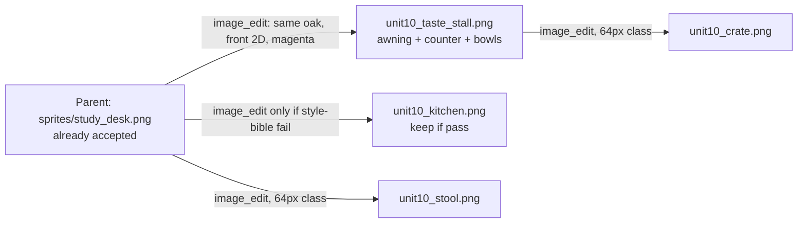
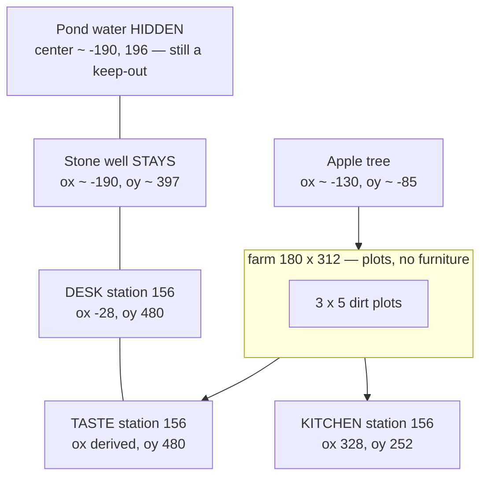

# Unit 10 Farm Prop Set: Visual and Spatial Consistency

| Field | Value |
|---|---|
| **Author** | TBD |
| **Date** | 2026-08-19 |
| **Status** | Approved |
| **Repo** | `C:\VibeCode\Hangeul Valley` (`daveynfts/Hangeul-Valley`) |
| **Scope** | 2B Unit 10 textbook world (`worlds/2b-unit-10.json`), not Valley level 26 |
| **Pipeline source of truth** | `farm-pixel-props` skill. Git home: `.grok/skills/farm-pixel-props/`. Runtime/generate home (Grok resolves first): `C:\Users\caokh\.grok\skills\farm-pixel-props\SKILL.md` — sync after the repo patch, before `image_edit`. |

**Implementation status (2026-08-20).** Shipped: HD desk / kitchen / stall under `sprites/furniture/` and `sprites/stalls/`, catalogued in `sprites/catalog.json`. Farmer is an HD PNG, not a chef palette-swap. The `assets/` mirror is retired; `main.py` serves the repo root; `process_prop.py` writes `sprites/` only. Historical filenames in this snapshot (`study_desk.png`, `unit10_kitchen.png`, `unit10_taste_stall.png`) were renamed into the taxonomy folders. Dual-write / lockstep instructions below are historical — do not reintroduce `assets/`.

**Numbers in this document are a design snapshot.** Runtime/pipeline constants (156 px height, 2 px pad, magenta key, origin `(0.5, 1)`, scale `1.0` for the station class, depth `y+6`, no y-bob) live in the skill. Farm grass/wood/dirt hex lives in `STARDEW_PALETTE` in `game.js`. Do not copy those values into `game.js` comments as a third source.

---

## Overview

2B Unit 10 reuses the Valley farm loop (3×5 dirt plots, procedural grass, chef player) but overlays three “stations” for the textbook pack 뭐 먹을래?: a study desk (English MCQ), a kitchen (cooking UI), and a taste stall (한 입). Two of those stations are already Imagine-generated front-facing PNGs (`sprites/study_desk.png` 138×156, `sprites/unit10_kitchen.png` 92×156). The third is still a `PixelArtRenderer` letter matrix (`taste_stall`, 18×16 cells × `PS=3` → 54×48 px) drawn at `scale: 2.4` with a y-bob tween and no drop shadow. The result is three pieces of furniture that do not read as one carpenter’s set, sitting on a 16-bit farm that was never a matching prop catalog.

This design defines a **Unit 10 / farm-world prop set contract**: one parent PNG, one camera, two height classes, one placement rule around the 180×312 farm rectangle, and one Phaser spawn path. Taste becomes a real 156 px PNG via `image_edit` from the accepted desk. Admin pins and `worlds/unit10-layout.json` stay the farm-relative `ox`/`oy` contract. Valley farm, pond, and portal are not deleted — `syncUnit10World` already hides them.

*(Product, Vietnamese: thiết kế lại bộ prop Unit 10 cho đồng bộ trên cả map — cùng một thợ mộc, cùng cỡ, cùng mặt đất; quầy 한 입 thành PNG 156 px, không còn isometric/scale 2.4, không đè luống hay ao.)*

---

## Background & Motivation

### Current state

Unit 10 is a textbook world pack, attached at runtime by `attachTextbookWorld` from `worlds/2b-unit-10.json` (80 words, six groups). It is **not** Valley level 26. `FarmScene.syncUnit10World` (`game.js`) gates the overlay:

- Plots stay visible (`_setPlotsVisible(true)`).
- Pond is hidden (`_setPondVisible(!on)`), including dock, fish hint, lily/reed/ocean textures, and ellipse water.
- Minigame NPCs hide (`shopNPC`, board, arcade, wizard, cat, beehive, portal, dock).
- Portal sprite/hint hide.
- Player swaps to the procedural `chef_*` walk cycle (`_unit10Skin`).
- Three stations spawn: `_ensureStudyDesk`, `_ensureKitchen`, `_ensureTasteStation`.

Stations are positioned by `unit10StationXY(farm, spec)` = `{ x: farm.x + ox, y: farm.y + oy }`. Specs come from Phaser cache JSON `unit10-layout` (`worlds/unit10-layout.json`), falling back to `UNIT10_LAYOUT_DEFAULT` in `game.js`.

Farm rectangle is computed in `_drawWorld`:

```js
// game.js — PLOT_COLS=3, PLOT_SIZE=48, PLOT_GAP=18, 5 rows
fW = 180; fH = 312;
this.farm = { x: W/2 - fW/2, y: H/2 - fH/2 - 30, w: fW, h: fH };
```

That 180×312 matches `worlds/unit10-layout.json` `"farm": { "w": 180, "h": 312 }` and the admin schematic (`admin/public/js/world.js` `FARM_W`/`FARM_H`).

| Station | File | Texture key | Layout now | Display |
|---|---|---|---|---|
| `desk` | `sprites/study_desk.png` + `assets/sprites/` | `study_desk_hd` (fallback matrix `study_desk`) | `ox:-28, oy:480, scale:1, originX:0.52, interact:80` | 138×156 @ 1.0, origin bottom, shadow, no bob |
| `kitchen` | `sprites/unit10_kitchen.png` + `assets/sprites/` | `unit10_kitchen_hd` (fallback matrix `unit10_kitchen`) | `ox:328, oy:252, scale:1, originX:0.48, interact:82` | 92×156 @ 1.0, origin bottom, shadow, steam puffs |
| `taste` | **no PNG** | matrix `taste_stall` (fallback `shop_sign`) | `ox:144, oy:394, scale:2.4, originX:0.5, interact:64` | 54×48 × 2.4 ≈ 130×115, **y-bob ±3 px**, **no shadow** |

`FarmScene.preload` loads the two HD images and the layout JSON; it does not load a taste PNG.

### Pain points (user-reported and code-visible)

1. **Two pipelines on one map.** HD oak furniture next to a 20-letter brown stall and 3 px grass tiles. The mismatch is the product complaint, not “the desk could be prettier.”
2. **Taste `scale: 2.4` is a smell.** It exists only because the matrix is 48 px tall. The skill forbids ad-hoc scale on the 156 px set.
3. **Y-bob on a planted prop.** `_ensureTasteStation` tweens `y: y-3`. The skill: planted props do not bob; it reads as hover.
4. **South overlap with plots.** Skill south rule: `oy >= farm.h + spriteDisplayHeight`. Desk already uses `farm.h + 168 = 480`. Taste at `oy:394` with ~115 px display height puts the awning at `oy ≈ 279`, which is inside the farm (`h=312`) and over the bottom plot row (row 4 center `oy ≈ 288`). That is the “furniture on the plots” class of bug, even though the comment `taste table sits on plot 0` is stale — `tasteStation.plotIndex` is never assigned.
5. **Historical isometric / pond sitting.** Earlier art sat on the west pond. Pond is now hidden on Unit 10, and the skill (body) is front-facing 2D, but the skill **frontmatter still says isometric**. Desk/kitchen PNGs are already orthographic; taste never got the same pass.
6. **Dead skip-plot logic.** `_updateTargetHighlight` / `_interact` / free-plot picker still skip `tasteStation.plotIndex`. Harmless today (undefined), misleading tomorrow if someone re-anchors the stall to a plot.

### What is already correct (do not rebuild)

- Front-facing 2D PNG pipeline (`image_gen` 1:1, magenta `#FF00FF`, `process_prop.py`, dual write).
- Desk and kitchen already match each other (same oak, same 156 px, same origin/depth). Treat `study_desk.png` as the **set parent**.
- Farm-relative layout JSON + admin drag pins (`admin` Unit 10 tab → `PUT /api/unit10/layout` → `admin/lib/world.js` `saveLayout` writes both `worlds/` and `assets/worlds/`).
- English desk quiz stays in `worlds/unit10-desk-quiz.json` (20 MCQs, `sessionSize: 5`). CI `scripts/validate_content.js` forbids Vietnamese in that bank.
- R2 hosts sprites/worlds; `game.js` / `index.html` stay on Vercel (`vercel.json` rewrites `/sprites/:path*` → `cdn.daveynfts.com/hangeul-valley/sprites/`).
- Valley farm, portal, pond code paths remain; Unit 10 only toggles visibility.

---

## Goals & Non-Goals

### Goals

1. One visual set: desk, kitchen, taste stall (and at most two non-interactive accents) look like the same 16-bit carpenter built them.
2. One spatial contract around the 180×312 farm: sit on grass, never overlap plots, never occupy the pond ellipse even though the pond is hidden, never collide with the stone well that **stays** visible.
3. Taste stall becomes a real PNG at the 156 px station height class; `scale: 2.4` and y-bob go away.
4. Admin pins, `unit10-layout.json` schema (`id, nameKo, nameEn, ox, oy, scale, originX, interact`), and the three station ids stay.
5. Extend `farm-pixel-props` into a **set contract** (shared parent, height classes, naming) without duplicating pipeline numbers into `game.js`.
6. PR-sized rollout: generate → process + sprite lockstep → Vercel gameplay → **one** R2 batch (layout JSON + new PNG together). Git merge does not publish `/worlds/` or `/sprites/`.

### Non-Goals

- Regenerating the Valley farm, player, chef, crops, pond, portal, HUD, or minigame NPCs as PNGs.
- Adding a fourth interactive station or changing `admin/lib/world.js` `STATION_IDS` (`['desk','kitchen','taste']` — “exactly 3”).
- Rewriting quiz / cooking / taste overlay UI (`#desk-quiz-*`, cooking minigame, `#taste-overlay`).
- Renaming shipped files `study_desk.png` / `unit10_kitchen.png` (R2 cache + preload keys).
- Deleting Valley portal/pond/cat code; visibility toggle stays.
- Putting Vietnamese in `game.js` / `index.html`.
- Hosting `game.js` / `index.html` on R2.
- A second copy of `process_prop.py` under `scripts/` (skill owns the script).
- Pixel-perfect matching of HD oak to 3 px `grs*` tiles — that is structurally impossible. The goal is **set-internal** consistency plus grass contact, not making Imagine output look like `PixelArtRenderer`.

---

## Proposed Design

### 1. Full Unit 10 map prop inventory

#### Interactive stations (layout JSON, admin pins) — height class **station (156 px)**

| id | PNG | Phaser load key | Role | Baked into the bitmap (not extra files) |
|---|---|---|---|---|
| `desk` | `sprites/study_desk.png` (keep) | `study_desk_hd` | English MCQ (`openDeskQuiz`) | Lamp, books, inkwell, open workbook — already present |
| `kitchen` | `sprites/unit10_kitchen.png` (keep unless style-bible fail) | `unit10_kitchen_hd` | Cooking UI (`openCookingUI`) | Hood, pots, pan, greens — already present |
| `taste` | **new** `sprites/unit10_taste_stall.png` | `unit10_taste_stall_hd` | Taste minigame (`openTasteGame`) | Red/cream striped **awning**, oak counter, 3–5 tasting bowls, hanging lantern **silhouette**, no text |

Awning, seating-at-the-counter, and stall signage are **part of the taste PNG**, not separate sprites. That keeps admin at three pins and keeps feet as the last opaque row.

#### Non-interactive accents — height class **accent (64 px)** — optional, same PR as art if cheap, else follow-up

Spawned as offsets from a station origin inside `_ensureStudyDesk` / `_ensureKitchen`. **Not** in `unit10-layout.json`. **Not** admin-draggable.

| PNG | Anchor | Purpose |
|---|---|---|
| `sprites/unit10_stool.png` | desk, `(-56, 0)` farm-relative from desk feet (west of the kneehole) | One oak stool so the desk is a place, not a floating table |
| `sprites/unit10_crate.png` | kitchen, `(40, 8)` from kitchen feet | One crate so the east pad matches shop-adjacent barrels that Unit 10 hides |

**Default: do not wire accents in the gameplay PR**, even if the art PR generated the files. They may sit unused under `sprites/` until a follow-up. If a later PR wires them:

- Origin `(0.5, 1)`, scale `1.0`, depth `y+6`, `createShadow(spr, 32, 10, 2)`, no y-bob, no interact, no SPACE label.
- Spawn only when `this.textures.exists(hdKey)` — never `this.load.image` a file the art PR did not ship (Phaser 3 404s optional CDN URLs).
- Stool at desk `(-56, 0)` is **inside** interact radius 80. That is OK: SPACE still opens the desk quiz; the stool is scenery.
- **Skip** an accent only if its opaque pixels cover a plot tile or the well, not because the player can stand on it.

#### Ground / path — procedural, no new PNGs

- Grass: existing `grs0–3` tiles (`_tileGround`).
- Plots: existing `drt_dry` 48 px tiles, 3×5.
- Flowers / fence / well / apple tree: keep. Apple tree (NW, `farm.x-130, farm.y-85`) and well (SW, `farm.x-190, farm.y+farm.h+85`) stay visible on Unit 10.
- Optional in `_ensureTasteStation`: stamp 6–8 existing `path_stone` tiles from farm south-center `(farm.w/2, farm.h+20)` down to the south band, so desk and stall share a dirt path. Reuse `path_stone`, do not generate a path PNG.

#### Stays procedural (do not PNG)

| Thing | Why |
|---|---|
| Grass, dirt plots, crop growth stages | `PixelArtRenderer` + `CROP_FARM_PAL`; 15-plot SRS loop |
| Player / chef walk cycles | `chef_*` matrices; Unit 10 already swaps skin |
| Pond, lilies, reeds, dock, fish | Hidden on Unit 10; Valley still needs them |
| Portal, shop, arcade, wizard, cat, beehive | Hidden on Unit 10; do not delete |
| Fences, well, barrels, signpost, butterflies, weather | Shared world dressing |
| HUD, quiz/taste/cooking DOM overlays | HTML/CSS, not sprites |
| Steam / lamp glow / hood flame | Phaser circles + tweens, positioned from **displayHeight**, not baked into PNG |

Matrix keys `study_desk`, `unit10_kitchen`, `taste_stall` stay as **missing-file fallbacks only**.

### 2. Style bible (generate-from-this)

Authoritative camera / processing / Phaser placement: `farm-pixel-props` skill. Palette keys: `STARDEW_PALETTE` in `game.js` (lines ~291–384) plus the existing station palettes `DESK_PAL` / `KITCHEN_PAL` / `TASTE_STALL_PAL` in `_bakeTextures`.

**Camera.** Straight-on front view, orthographic 2D, subject facing the camera. Not isometric, not ¾, not top-down. One prop per image. `image_gen` aspect `1:1`.

**Isolation.** Flat solid magenta `#FF00FF`. No grass, no floor, no baked shadow, no scene, no text (overlays localize). Feet = last opaque row after crop.

**Outline.** Chunky dark contour, 1–2 px in the source, mapping to `STARDEW_PALETTE.outlineDark` `#121016`. No hairline vector outlines.

**Materials (hex — match these, do not invent a second farm palette).**

| Role | Hex | Source |
|---|---|---|
| Outline | `#121016` | `STARDEW_PALETTE.outlineDark` |
| Oak highlight | `#B3713D` | `woodHighlight` |
| Cedar / oak base | `#8F5428` / `#C4893A` | `woodBase` + desk `O` |
| Timber shadow | `#573012` | `woodShadow` |
| Paper / cream cloth | `#FFF8E8` | desk `W` / taste `W` |
| Lamp / gold | `#FDE047` / `#F59E0B` | desk lamp |
| Awning red | `#DC2626` / `#9F1239` | `TASTE_STALL_PAL` `R`/`r` |
| Metal hood | `#A8A29E` / `#78716C` | `KITCHEN_PAL` `I`/`i` |
| Cook greens | `#166534` / `#86EFAC` | kitchen / stall bowls |
| Dirt (do not paint under feet) | `#7E5436` | `dirtDry` |
| Grass (do **not** paint) | `#4A7C59` / `#2D4E35` / `#6B9E77` | `grassBase` / Shadow / Highlight |

**How they sit on the farm.** Grass tiles are `#4A7C59` with `#2D4E35` shade. Props must **not** include a grass pad; Phaser `createShadow` supplies contact darkening (`DynamicShadowSystem`, ellipse under feet, offsetY ≈ 2 for furniture). Dirt plots `#7E5436` are the thing we must not cover.

**Pixel density.** SNES / Stardew 16-bit game prop, chunky pixels. Phaser already has `render.pixelArt: true` and `setRoundPixels(true)`; that is why HD desk/kitchen are sharp enough. Applying `setFilter(NEAREST)` on each `*_hd` after load is a one-liner belt-and-suspenders (matrix textures already set it; `this.load.image` paths do not). It is **not** why taste looks like a brown box and is not a separate acceptance criterion.

**Height classes.**

| Class | `--height` | Phaser scale | Use |
|---|---|---|---|
| `station` | 156 (script default) | 1.0 | desk, kitchen, taste stall |
| `accent` | 64 | 1.0 | stool, crate |

Do not introduce a third class. Do not use `scale: 2.4` to fake height.

**FX that stay code.** Steam (taste), hood flame (kitchen), lamp glow (desk) remain Phaser circles. Offsets are derived from the sprite’s `displayHeight` so a 156 px stall does not keep the matrix-era `y-52` steam.

### 3. Edit-chain (same carpenter)

Do **not** fire three independent `image_gen` calls. `game-asset-core`: the same object again is edit-chained from the existing base.



**Sequence.**

1. **Parent = current `study_desk.png`.** User already accepted the front-facing 2D PNG pipeline. Do not regenerate the desk unless a magenta fringe or isometric remnant is found on read-back.
2. **Kitchen.** Blind-describe `unit10_kitchen.png` against the style bible. If it already shares oak, outline, camera, and 156 px feet — **keep it**. Only `image_edit` from the desk if metal/wood diverge.
3. **Taste stall.** `image_edit` from the desk (not a fresh `image_gen`). Prompt shape (2–5 sentences, generator language):
   - Same 16-bit oak carpenter as the reference desk, straight-on front view.
   - Korean pojangmacha: red-and-cream striped awning, oak counter, clay bowls of stew/noodles, small hanging lantern; no letters.
   - Isolated on flat magenta `#FF00FF`; no grass, no shadow, no floor.
4. **Accents.** `image_edit` stool from desk (same turned legs). `image_edit` crate from stall or desk. Process with `--height 64`.
5. **Verify.** Blind describe each PNG before re-reading the spec (`game-asset-core`). Fail on leftover magenta (including rose `#C62090`), baked grass, isometric tilt, text, or feet that are not the last opaque row.
6. **Process + record width.** From repo root:

```text
python .grok/skills/farm-pixel-props/scripts/process_prop.py <src> unit10_taste_stall --root .
python .grok/skills/farm-pixel-props/scripts/process_prop.py <src> unit10_stool --root . --height 64
```

`process_prop.py` already keys `#FF00FF` **and** rose `#C62090`-class fills (`g < 90 and r > 160 and b > 100 and r > g + 70`), crops 2 px pad, resizes height, keys again (LANCZOS can reintroduce fringe), writes `sprites/<name>.png` and `assets/sprites/<name>.png`. It prints `(w, h)` and **does not cap width** (`nw = max(8, int(round(im.width * (max_h / im.height))))`).

**PR 2 acceptance (art fails, do not merge):**

| Check | Rule |
|---|---|
| Height | station `h === 156`; accent `h === 64` |
| Width cap | taste stall `w <= 220`. A pojangmacha awning often exceeds the 160 px *budget*; above 220 fail and re-edit (narrower awning / crop), do **not** unbounded-bump `ox` |
| Dual write | `sprites/<name>.png` bytes === `assets/sprites/<name>.png` (raw bytes; orphans in either tree fail) |
| Fringe / feet | no magenta/rose; last opaque row is feet |
| Printed size | PR description records the `process_prop.py` `(w, h)` line — PR 3 **derives** taste `ox` from that width |

### 4. Placement contract (whole farm rectangle)

World position: `unit10StationXY` unchanged — `{ x: farm.x + ox, y: farm.y + oy }` with origin `(originX, 1)`.



**Keep-out regions** (farm-relative). Interact sprites’ AABB (display width × 156, origin at feet) must not intersect:

| Zone | Farm-relative rect | Why |
|---|---|---|
| Plots | `[0, 180] × [0, 312]` | 15 SRS plots; furniture covering dirt is the original bug |
| Pond water + ring | ellipse center `(−190, 196)`, rx `140+14`, ry `50+14` | `_createFishingSpot`: pond *anchor* is `(fx, fy)` = farm-relative `(−190, 176)` (`farm.h/2+20`); water is drawn at `fy+20` / `fy+24`. `_setPondVisible` searches around `(−190, farm.h/2+40)` = `(−190, 196)`. `pondRadiusX/Y` = 140 / 50; stones at radius+14. Hidden, but the hole is still “water” |
| Well | ~`(-190, 397)` origin feet, ~44×14 shadow | Still drawn on Unit 10 (`_drawWorld`, not in `_setMinigameSpritesVisible`) |
| Apple trunk | ~`(-130, -85)` | NW, away from stations; do not migrate desk north |

**South band (desk, taste).** Minimum clear is `oy >= farm.h + displayHeight` (156 class → `>= 468`). **Placed** south-row value is `farm.h + 168 = 480` (12 px grass gutter; desk already sits here). Taste uses the **same** `oy`, not 468.

| id | ox | oy | scale | originX | interact |
|---|---|---|---|---|---|
| `desk` | `-28` | `480` | `1` | `0.52` | `80` |
| `taste` | **derived** (144 if `w ≤ 160`) | `480` | `1` | `0.5` | `80` |
| `kitchen` | `328` | `252` | `1` | `0.48` | `82` |

**Taste `ox` is derived from the processed width, not locked at 144.** `process_prop.py` keeps aspect; an awning will often be wider than 160 px.

```
desk_right = -28 + (1 - 0.52) * 138   // ≈ +38.24
taste_ox   = desk_right + 24 + stall_w * originX
           = 62.24 + stall_w * 0.5
// if stall_w <= 160, keep ox = 144 (matches the formula at w ≈ 164)
```

Worked examples: `w=160` → `ox≈142` (keep 144); `w=180` → `ox=152`; `w=220` (cap) → `ox=172`. Do not scale the PNG down.

Kitchen is a **different row** (`oy: 252`, AABB y ≈ 96–252 vs taste y ≈ 324–480). Bumping taste east cannot AABB-hit the kitchen. If `w > 220`, **fail the art PR** and re-edit; do not walk the stall off the canvas or toward the well.

**East pad (kitchen).** Skill: left edge past `farm.x + farm.w`, feet on grass at `oy ≈ farm.h/2 + 96 = 252`. Kitchen 92 px, origin 0.48 → left edge `328 - 0.48×92 ≈ 284` (104 px past farm right 180). Shop NPC at `farm.w+175, farm.h/2+25` is hidden on Unit 10, so the pad is free. Keep kitchen here.

**Taste `scale: 2.4` decision.** It becomes a real PNG at station height 156, Phaser scale **1.0**. Matrix fallback (missing file only) uses a **per-station** internal scale that **ignores** `spec.scale`: desk `2.3`, kitchen `2.35`, taste `2.4` (today’s values). Do not silently unify those three to `2.4`.

HD scale is **not** `spec.scale`. Stale R2/browser JSON can still say `2.4` for 60–600 s after a same-URL overwrite (`vercel.json` `/worlds/(.*)` is `max-age=60, stale-while-revalidate=600`; `upload_r2.js` JSON CacheControl is `max-age=60`). Use:

```js
function hdStationScale(spec) {
  const s = spec && spec.scale;
  return (typeof s === 'number' && s > 0 && s <= 1.2) ? s : 1;
}
// setScale(hd ? hdStationScale(spec) : matrixScale)
```

Admin “Scale” still round-trips in JSON for nudges in `(0, 1.2]`. A cached `2.4` is treated as missing and becomes `1`. Layout JSON for this set is written as `1`. This clamp does **not** fix a stale `oy: 394` (156 px still overlaps row 4) — that needs the cache-busted layout URL below.

**No y-bob** on desk, kitchen, taste, stool, crate. Steam/flame/glow may tween alpha/scale.

**Depth.** `spr.setDepth(y + 6)`; label `y + 8`; shadow via `createShadow`. Target-highlight boxes for taste bump from 48×48 to ~70×72 so SPACE chrome matches the 156 px footprint.

**Interact.** Taste `interact` 64 → **80** (footprint ~80, skill). Kitchen 82 / desk 80 stay.

**Well vs desk.** Well at ox `-190`, desk left edge ≈ `-28 - 0.52×138 ≈ -100`. ~90 px gap. Do not move desk west into the pond keep-out.

**Stale plot-0 coupling.** Remove `tasteStation.plotIndex` skips in `_updateTargetHighlight`, `_interact` (`skipStation`), and the free-plot filter. Fix the comment on `syncUnit10World` (“taste table sits on plot 0”) to “stations sit on grass south/east of the farm rect; pond hidden; portal hidden.”

### 5. Layout JSON / admin pins / Phaser load keys

**Keep.** `worlds/unit10-layout.json` version 1, exactly three stations, farm-relative `ox`/`oy`. Admin Unit 10 tab (`admin/public/index.html` `#tab-unit10`, `admin/public/js/world.js`) still drags three pins. `saveLayout` still requires `STATION_IDS = ['desk','kitchen','taste']` and writes both trees.

**Change values, not schema.** Taste `ox` in the committed JSON is whatever PR 2’s printed width produces (formula above). Snapshot below assumes the 160 px budget; replace `144` if `w > 160`.

```json
{
  "version": 1,
  "farm": { "w": 180, "h": 312 },
  "stations": [
    { "id": "desk",    "nameKo": "학습 책상",     "nameEn": "Study desk",  "ox": -28, "oy": 480, "scale": 1, "originX": 0.52, "interact": 80 },
    { "id": "kitchen", "nameKo": "요리 주방",     "nameEn": "Kitchen",     "ox": 328, "oy": 252, "scale": 1, "originX": 0.48, "interact": 82 },
    { "id": "taste",   "nameKo": "한 입 포장마차", "nameEn": "Taste stall", "ox": 144, "oy": 480, "scale": 1, "originX": 0.5,  "interact": 80 }
  ]
}
```

Update the duplicate defaults in:

- `game.js` `UNIT10_LAYOUT_DEFAULT`
- `admin/public/js/world.js` `DEFAULTS.taste` (`scale: 2.4` → `1`, `oy: 394` → `480`, `interact: 64` → `80`, `ox` = derived)

`u10-reset-station` does `Object.assign(station, DEFAULTS[id])`. Those `DEFAULTS` **must** match the new JSON; otherwise Reset restores `scale: 2.4` / `oy: 394` and undoes the south-band move. QA: Reset is “restore shipped HD layout,” not “restore the matrix stall.”

Do **not** add accent props to this JSON (would break “exactly 3 stations”).

**Phaser load** (`FarmScene.preload`) — only keys whose files exist in the art PR. Do **not** add stool/crate `load.image` lines unless a follow-up actually wires them (a missing CDN file 404s):

```js
this.load.json('unit10-layout', 'worlds/unit10-layout.json?v=southband');
this.load.image('study_desk_hd', 'sprites/study_desk.png');
this.load.image('unit10_kitchen_hd', 'sprites/unit10_kitchen.png');
this.load.image('unit10_taste_stall_hd', 'sprites/unit10_taste_stall.png');
```

Query string is a **cache buster**, not a schema change. `/worlds/:path*` rewrite keeps the query; R2 key stays `hangeul-valley/worlds/unit10-layout.json`. Browsers that cached the unversioned URL for 60–600 s will not reuse it. Next layout tweak **must bump the token** (`?v=southband2`, …) or the same-URL SWR hole returns. Do not load the unversioned path in parallel.

After load, one-liner: if `textures.exists(key)` for each `*_hd`, `setFilter(NEAREST)`. Not a merge gate; Phaser `pixelArt: true` already covers the visual.

**Spawn contract.** Collapse the three `_ensure*` *bodies* so HD-vs-matrix, origin, depth, shadow, label, and “no bob” cannot drift. Keep `_ensure*` / `_teardown*` as the public wrappers (`syncUnit10World` still calls them).

Each `_ensure*(id)`:

1. If `!this.farm`, **return** (do not spawn). Do **not** copy the stale fallback `{ x: 300, y: 220, w: 400, h: 280 }` — `unit10StationXY` already defaults to `{ w: 180, h: 312 }`, and after `_drawWorld` `this.farm` is always set. A second farm size is a lie.
2. Call matching `_teardown*`.
3. Call `_spawnUnit10Station(id, spec)`.
4. Attach per-station FX. Do **not** spawn accents in this PR.

```js
_spawnUnit10Station(id, { hdKey, matrixKey, lastKey, shadowW, matrixScale, fx }) {
  const spec = getUnit10Station(id);
  const pos = unit10StationXY(this.farm, spec);
  const hd = this.textures.exists(hdKey);
  const tex = hd ? hdKey
    : (this.textures.exists(matrixKey) ? matrixKey : lastKey);
  const spr = this.add.image(pos.x, pos.y, tex)
    .setOrigin(spec.originX || 0.5, 1)
    .setScale(hd ? hdStationScale(spec) : matrixScale)
    .setDepth(pos.y + 6);
  if (hd && spr.texture) spr.texture.setFilter(Phaser.Textures.FilterMode.NEAREST);
  const hdShadowW = typeof shadowW === 'function'
    ? shadowW(spr) : shadowW;
  if (this.shadows) this.shadows.createShadow(spr, hd ? hdShadowW : 52, 16, 2);
  const label = this.add.text(pos.x, pos.y + 8, (spec.nameKo || id) + '\n[SPACE]', {
    fontFamily: '"Noto Sans KR",sans-serif', fontSize: '14px',
    color: '#fff8e8', stroke: '#2a1a0a', strokeThickness: 4, align: 'center'
  }).setOrigin(0.5, 0).setDepth(pos.y + 10).setAlpha(0);
  // NO this.tweens.add on spr.y
  const extra = fx ? fx(spr, pos, spec, hd) : {};
  return { x: pos.x, y: pos.y, spr, label, interact: spec.interact || 80, ...extra };
}
```

Per-id table (pass as the second argument):

| id | hdKey | matrixKey | lastKey | shadowW (HD) | matrixScale |
|---|---|---|---|---|---|
| `desk` | `study_desk_hd` | `study_desk` | `pixel_crate` | `78` (today) | `2.3` |
| `kitchen` | `unit10_kitchen_hd` | `unit10_kitchen` | `shop_sign` | `58` (today) | `2.35` |
| `taste` | `unit10_taste_stall_hd` | `taste_stall` | `shop_sign` | `min(90, Math.round(spr.displayWidth * 0.55))` | `2.4` |

Matrix scales stay **per-id**. Unifying them to `2.4` would silently change desk/kitchen missing-file size.

**FX** (only tween alpha/scale, never `spr.y`):

- Taste steam: `pos.y - spr.displayHeight * 0.82` (awning), not matrix-era `y-52`.
- Kitchen flame: `pos.y - spr.displayHeight * 0.76` (hood).
- Desk glow: `pos.x - 26`, `pos.y - spr.displayHeight * 0.63` (keep the current `x-26` lamp offset).

**Teardown** (each `_teardown*`):

- Destroy `spr`, `label`, and the FX list (`steam` / `glow` / `flame`).
- Do not manually remove `DynamicShadowSystem.shadows` entries. `createShadow` pushes a container; `updateAllShadows` already GC’s when `_target` is inactive. `_ensure*` is called on every `syncUnit10World`, so the old sprite must be destroyed first (already the pattern) or shadows leak until the next day-night tick.

**AABB assertion (PR 3, `validate_content.js` only — not a comment).** `validate_content.js` today `readFileSync(..., 'utf8')` on listed text files and has no `pngjs`. Add a zero-dependency IHDR reader:

```js
function pngSize(rel) {
  const buf = fs.readFileSync(path.join(ROOT, rel));
  if (buf.length < 24 || buf.toString('ascii', 1, 4) !== 'PNG') {
    throw new Error(rel + ' is not a PNG');
  }
  return { w: buf.readUInt32BE(16), h: buf.readUInt32BE(20) };
}
```

For each station PNG (`sprites/study_desk.png`, `sprites/unit10_kitchen.png`, `sprites/unit10_taste_stall.png` once it exists):

- `h === 156`.
- Read `ox` / `oy` / `originX` from committed `worlds/unit10-layout.json` (not a hardcoded 160).
- South (`desk`, `taste`): `oy - h >= farm.h`.
- East (`kitchen`): `ox - originX * w >= farm.w`.
- The three AABBs `[ox - originX*w, ox + (1-originX)*w] × [oy - h, oy]` do not intersect.

A `w = 220` stall left at snapshot `ox: 144` must **fail** (left ≈ 34 vs desk right ≈ 38). Admin `PUT /api/unit10/layout` can drag pins over plots; only this committed-JSON + IHDR check catches that on the next PR. Do not substitute a comment next to the layout file. Manual walk still covers well, path stones, and SPACE chrome. Existing root↔`assets/` text lockstep is unchanged; sprite **bytes** already land in PR 2.

### 6. Skill delta (`farm-pixel-props`) — set contract, not a second pipeline copy

**Yes, extend the skill.** The class of problem is “farm-world prop **set**,” not “prettier desk.” Do not rewrite the skill as a duplicate of sections 1–5 of this doc. Patch only:

1. **Frontmatter `description`:** replace “isometric pixel-art PNGs” with “front-facing 2D pixel-art PNGs.” Body already says orthographic 2D; the header currently lies and will regenerate the old isometric failure.
2. **New short section “Set contract”** after §1 Generate (or as §1b), containing **only** facts that are not already in §§1–5:
   - A set shares one parent PNG; later pieces are `image_edit` from that parent, never three sibling `image_gen`s.
   - Height classes: `station` = script default 156; `accent` = `process_prop.py --height 64`. Do not restate crop/key/origin/depth here — point at §§2–3.
   - Naming: new world-pack props `unit10_<role>.png`. Do not rename shipped `study_desk.png` / `unit10_kitchen.png`.
   - Palette: match `STARDEW_PALETTE` wood/outline in `game.js`; do not paint grass or ground. Do not duplicate the hex table in the skill.
   - One Phaser spawn path per set (HD key, matrix fallback, scale 1 on HD, no bob).
3. **§4 Sit on the grass — replace the conflicting south bullet**, do not add a sentence beside it. Today the skill says both `y >= farm.y + farm.h + spriteDisplayHeight` **and** “desk uses `farm.h + 168`,” and it still opens with “Isometric art is tall.” After the patch:
   - Drop “Isometric art is tall.”
   - South bullet: station-class south row is `farm.h + 168` (shared `oy` for siblings). The inequality `>= farm.h + displayHeight` is the **minimum clear**, not the placed value.
   - Pond ellipse is a keep-out even when `_setPondVisible(false)`.
4. **Do not** paste `UNIT10_LAYOUT_DEFAULT` numbers, admin pin ids, or `getUnit10Station` into the skill. Those belong to `unit10-layout.json` / `game.js`.

**Two homes, two steps.** Only the project copy is in `daveynfts/Hangeul-Valley`. Grok resolves `/farm-pixel-props` from the **user** skill first (`C:\Users\caokh\.grok\skills\farm-pixel-props\SKILL.md`). PR 1 patches **only** `.grok/skills/farm-pixel-props/SKILL.md` in the repo. Before any `image_edit`, copy/sync that file (and `scripts/process_prop.py` if it drifted) onto the user skill. Generating from the unpatched user frontmatter (“isometric pixel-art PNGs”) recreates the failure PR 1 exists to prevent.

`process_prop.py` already has `--height` and rose-key; no script change expected unless a third Imagine fill appears.

### Architecture (runtime)

```mermaid
sequenceDiagram
  participant Preload as FarmScene.preload
  participant Layout as unit10-layout.json
  participant Skill as process_prop.py (authoring)
  participant R2 as cdn.daveynfts.com
  participant Sync as syncUnit10World
  participant Spawn as _spawnUnit10Station

  Skill->>Skill: image_edit from study_desk.png
  Skill->>Skill: key / crop / height / write sprites + assets/sprites
  Note over R2: upload layout JSON + taste PNG in ONE batch after Vercel has the spawn helper
  Preload->>R2: load.image unit10_taste_stall_hd
  Preload->>Layout: load.json unit10-layout.json?v=southband
  Sync->>Sync: hide pond, portal, minigame NPCs; keep plots
  Sync->>Spawn: desk / kitchen / taste
  Spawn->>Layout: getUnit10Station + unit10StationXY
  Spawn->>Spawn: origin (ox,1), hdStationScale if HD, depth y+6, shadow, no bob
```

---

## API / Interface Changes

No network API shape change. Admin `GET/PUT /api/unit10/layout` already accepts `scale` / `ox` / `oy` / `interact`.

| Surface | Before | After |
|---|---|---|
| `FarmScene.preload` | 2 HD images; `worlds/unit10-layout.json` | + `unit10_taste_stall_hd`; layout URL `worlds/unit10-layout.json?v=southband` |
| `_ensureTasteStation` | matrix `taste_stall`, `setScale(spec.scale \|\| 2.4)`, y-bob, no shadow | HD PNG, `setScale(hd ? hdStationScale(spec) : 2.4)`, shadow, no bob |
| `scripts/validate_content.js` AABB | none | IHDR `pngSize` + layout JSON inequalities (PR 3) |
| `UNIT10_LAYOUT_DEFAULT.taste` | `oy:394, scale:2.4, interact:64` | `oy:480, scale:1, interact:80`, `ox` derived from printed width |
| Admin `DEFAULTS.taste` | same as above | same as layout (Reset uses this) |
| `scripts/upload_r2.js` `FILES` | desk + kitchen PNGs | + `sprites/unit10_taste_stall.png` (in the gameplay PR; run only after Vercel) |
| `scripts/validate_content.js` | text lockstep for js/html/json | + raw-byte lockstep `sprites/*` ↔ `assets/sprites/*` (both directions; lands with art) |
| Taste overlay DOM | unchanged | unchanged |

`getUnit10Station` / `unit10StationXY` / `syncUnit10World` **signatures stay**.

---

## Data Model Changes

`worlds/unit10-layout.json` schema unchanged. Value change for `taste`: `oy`, `scale`, `interact`, and possibly `ox` (derived from processed width). `admin/lib/world.js` `saveLayout` already round-trips those fields. Git-committed layout does **not** become what prod Phaser loads until `upload_r2.js` puts it on R2 (`vercel.json` rewrites `/worlds/:path*`). Same R2 key; Phaser fetches it as `unit10-layout.json?v=southband` so browsers do not reuse the unversioned cache.

No migration of player saves. Layout is not in `save_data.json`.

`assets/worlds/unit10-layout.json` must match (admin `writeBoth` + CI).

New binaries under `sprites/` and `assets/sprites/` only.

---

## Alternatives Considered

### A. Upscale the matrix stall (keep `PixelArtRenderer`, raise `PS` or scale)

- **Pros:** No Imagine, no magenta, no R2 upload, no lockstep binaries.
- **Cons:** The stall stays a 18×16 letter grid. Scale 2.4 already looks like a stamped brown box; 3.0 would be a bigger brown box. Does not solve “same carpenter as the oak desk.” User already rejected matrix furniture (“sprite đẹp” → PNG pipeline).
- **Verdict:** Reject. Matrix remains fallback only.

### B. Independent `image_gen` for each station (no edit-chain)

- **Pros:** Faster parallel generation.
- **Cons:** Three palettes, three cameras, three outline weights — the current desk-vs-stall problem. `game-asset-core` forbids regenerating the same object class fresh.
- **Verdict:** Reject. Parent = accepted desk PNG.

### C. Fourth admin pin + layout entries for stool/crate/sign

- **Pros:** Designers can drag seating.
- **Cons:** Breaks `STATION_IDS.length === 3` validator, admin schematic, and “interactive station” semantics (stool has no overlay). Overkill for two decorative sprites.
- **Verdict:** Reject for v1. Accents are code offsets. Revisit only if Unit 11+ needs a generic decor array.

### D. Hide plots on Unit 10 and build a restaurant tilemap

- **Pros:** Furniture could sit “inside” a room.
- **Cons:** Unit 10’s loop **is** the farm (80-word plant/harvest). Product is “same farm loop, textbook words,” not a new scene. Out of scope.
- **Verdict:** Reject.

### E. Chosen: PNG set + three pins + south-band alignment + skill set-contract

Matches the accepted pipeline, admin contract, and the class of problem (set, not one sprite).

---

## Security & Privacy Considerations

| Topic | Notes |
|---|---|
| Auth | Layout writes go through the local admin Express server (`admin/server.js`). No new public write endpoint. |
| Content | PNG files are static art. No user PII. No text in bitmaps (skill + `game-asset-core`) so Hangul/English/Vietnamese cannot bake into art. |
| Path traversal | `process_prop.py` writes only `sprites/<name>.png` under `--root`. Keep `name` as a basename (`unit10_taste_stall`); do not accept paths. |
| R2 | `upload_r2.js` uses env credentials; does not print secrets. New keys are the same prefix `hangeul-valley/sprites/`. |
| Cache | `/sprites/*` `max-age=86400`. **Prefer new filenames for new art.** `/worlds/(.*)` is `max-age=60, stale-while-revalidate=600` (Vercel header + R2 JSON CacheControl `max-age=60`). Same-URL layout overwrites are not instant — bump the Phaser `?v=` token on every layout change. |
| CI language gate | `scripts/validate_content.js` Vietnamese regex on `game.js` / `index.html` / worlds JSON. Art prompts and this doc may use Vietnamese product phrasing; committed game strings stay English + Korean vocab. |

Threat model is low: static assets + existing admin. Residual risk is CDN serving a stale sprite after a silent overwrite — mitigated by new keys for new props.

---

## Observability

No new backend metrics. This is a static Phaser client.

**Authoring checks (must run before merge):**

1. `process_prop.py` prints destination size; station class must be height 156; accent 64; taste `w <= 220`. Record `(w, h)` in the art PR.
2. Visual: zero magenta / rose fringe; feet = last opaque row; no baked grass.
3. `node scripts/validate_content.js` — including the sprite byte-lockstep (lands in the art PR).
4. `validate_content.js` IHDR + layout JSON (gameplay PR): `pngSize` on station PNGs, `h === 156`, south/east inequalities, three AABBs disjoint using **that** `w`. Then manual walk of well / path / SPACE chrome.

**Runtime (lightweight):**

- `textures.exists('unit10_taste_stall_hd')` already drives HD vs matrix. If HD missing, stall is tiny or scaled by the fallback branch — visible immediately.
- Do not add `console.log` spam. If needed, one warn when HD is missing: `console.warn('unit10_taste_stall_hd missing, matrix fallback')`.

**Alerting:** none. Regression caught by CI lockstep + a screenshot in the art PR.

---

## Rollout Plan

Feature flags: none. Unit 10 is already a world gated by `worldId === '2b-unit-10'`. Art is additive.

### Prod deploy coupling (Vercel `game.js` ≠ R2 `/worlds/` + `/sprites/`)

`vercel.json` rewrites `/worlds/:path*` and `/sprites/:path*` to `cdn.daveynfts.com/hangeul-valley/...`. `FarmScene.preload` loads layout and HD PNGs from those URLs. `game.js` / `index.html` deploy on Vercel. Layout JSON and sprites reach prod **only** when `node scripts/upload_r2.js` runs. `getUnit10Layout()` prefers the Phaser JSON cache over `UNIT10_LAYOUT_DEFAULT`, so updating the in-JS default does nothing in prod while the old R2 JSON still loads.

`FILES` already includes `worlds/unit10-layout.json`. Any `upload_r2.js` run after the gameplay PR — even with the *old* file list (no taste PNG) — would push `scale: 1` / `oy: 480` while preload still 404s the stall. Current `_ensureTasteStation` is `setScale(spec.scale || 2.4)` with **no** HD ternary: that upload-before-helper path makes the matrix stall 54×48 at scale 1.

The opposite order is also broken. After the helper is live, uploading the PNG while R2 still has `scale: 2.4` would draw a 156×2.4 giant stall **if** HD used `spec.scale`. That is why HD uses `hdStationScale` (ignore `> 1.2`) **and** why preload cache-busts the layout URL.

**Same-URL cache is the delayed “upload one without the other.”** The layout file keeps the key `hangeul-valley/worlds/unit10-layout.json`. Vercel `/worlds/(.*)` = `public, max-age=60, stale-while-revalidate=600`. R2 PutObject JSON = `public, max-age=60`. The taste PNG is a **new** key (uncached). After a “correct” batch, a client that loaded Unit 10 in the last 60–600 s can still have `unit10_taste_stall_hd` + cached `scale: 2.4` / `oy: 394` if it requested the unversioned URL. `getUnit10Layout()` prefers Phaser JSON cache, so `UNIT10_LAYOUT_DEFAULT` cannot save that client.

**Required order:**

1. Merge + wait until Vercel is serving the gameplay commit: `hdStationScale`, `unit10_taste_stall_hd` preload, and `this.load.json('unit10-layout', 'worlds/unit10-layout.json?v=southband')`. R2 still has old layout and no taste PNG → `hd === false` → matrix at 2.4. Playable, old look. The new query string is a cache miss even if the unversioned JSON is in SWR.
2. **One** `upload_r2.js` run that includes **both** `worlds/unit10-layout.json` (`scale: 1`, `oy: 480`, derived `ox`) **and** `sprites/unit10_taste_stall.png`. Confirm `LIST hangeul-valley/` then load Unit 10 (hard-refresh once if a tab still has the old bundle).
3. Never run `upload_r2.js` after merging layout in git if the spawn helper is not yet on Vercel. Never upload the PNG without the new layout in the same batch once the helper is live. Next layout change: bump `?v=` in `game.js` (Vercel) **before** or **with** the R2 overwrite — do not relearn this.

PR 2 binaries on git are unused in prod until that upload. `main.py` serves `assets/` and does **not** copy `sprites/` on launch — desktop only sees `assets/sprites/`, so dual-write + CI lockstep must land with the art.

### Git order (see PR Plan)

1. Skill set-contract in the **repo** copy + local sync to the user skill before generate.
2. Art PR: PNGs in both trees + `validate_content.js` sprite byte-lockstep (both directions).
3. Gameplay PR: spawn helper, `?v=southband` layout URL, `hdStationScale`, layout JSON, admin `DEFAULTS`, `upload_r2.js` `FILES` line, IHDR AABB in `validate_content.js`. **Do not run the uploader yet.**
4. Vercel deploy of `game.js`.
5. One R2 batch (layout + PNG).

**Staged exposure.** The window between (4) and (5) is the old matrix stall. That is the intended stage. Do not treat “HD 404 → fallback” as the happy path after upload.

**Rollback.** Re-upload the previous `unit10-layout.json` to R2 (restores `oy:394, scale:2.4`). That same-URL write is itself subject to 60–600 s SWR: **also revert or bump** the Phaser `?v=` token on Vercel so clients do not keep the south-band JSON. Leave or delete the unused PNG. Revert the Vercel gameplay commit if the helper itself is wrong. Do not delete Valley assets.

**Lockstep.** `process_prop.py` writes both trees. CI fails if any `sprites/*.png` bytes ≠ `assets/sprites/*.png`, or if either tree has an orphan. Desktop (`assets/`) vs browser/R2 (`sprites/`) is the failure mode.

---

## Risks

| Risk | Severity | Mitigation |
|---|---|---|
| Imagine leftover magenta / rose `#C62090` | High (already bit this repo) | `process_prop.py` keys both; key **after** LANCZOS; visual QA; fail the art PR on any pink fringe |
| Taste PNG at scale 1 with layout still 2.4 (or HD at leftover 2.4) | High | Vercel helper first (`hdStationScale` clamps `spec.scale > 1.2` to 1). Preload `unit10-layout.json?v=southband` so unversioned SWR cannot pair the new PNG with `oy:394` / `scale:2.4`. Then one R2 batch of layout JSON + PNG |
| Same-URL layout JSON cache (`max-age=60`, SWR 600) | High | Cache-bust query on every layout change. Clamp does not fix stale `oy`. Cite `vercel.json` `/worlds/(.*)` headers |
| Stall AABB overlaps bottom plots | High | `oy: 480` ⇒ top = 324 ≥ 312. PR 3 `pngSize` (IHDR bytes 16/20) + committed layout JSON; no hardcoded `w=160` |
| Stall wider than 160 px collides with desk | Medium | Derive `ox = desk_right + 24 + w * originX`; fail art PR if `w > 220` |
| Kitchen/desk regenerated “to match” and diverge | Medium | Edit-chain from desk; default **keep** kitchen/desk if they pass the bible |
| CI lockstep miss on binaries | Medium | `validate_content.js` raw-byte compare both directions, in the **art** PR, before more sprites land |
| R2 86400 cache on overwritten PNG | Medium | New filename for taste; do not recycle `study_desk.png` for a different drawing |
| Pond occlusion (user scar) | Medium | Pond keep-out remains even though `_setPondVisible(false)`; do not place west of ox ≈ `-120` |
| Well collision | Low | Keep desk at ox `-28`; well at `-190` |
| Accent stool steals desk interact | Low | Accents not wired in v1. If wired later: no interact; SPACE on the stool still opens the desk (OK); skip only if opaque pixels cover a plot or the well |
| `pixelArt:true` vs LANCZOS softness | Low | Existing `pixelArt: true` is sufficient; optional `NEAREST` one-liner, not an acceptance gate |
| Skill frontmatter still says isometric | Medium | Skill delta item 1; otherwise the next `/farm-pixel-props` run will emit isometric again |
| Vietnamese sneaking into `game.js` comments | Low | No new player-facing strings; CI regex already gates `game.js` / `index.html` |

---

## Open Questions

1. **Keep vs restyle kitchen/desk?** **Resolved (2026-08-19):** KEEP both current PNGs. Only add the taste stall via `image_edit` from `study_desk.png`. Restyle desk/kitchen only if QA later finds isometric leftovers or magenta.
2. **Generate stool + crate in the art PR?** **Resolved (2026-08-19):** YES, generate them in the same edit-chain session. Do **not** wire them in the gameplay PR. Files stay unused until a follow-up that adds `load.image` + spawn with the accent contract (origin `(0.5,1)`, shadow 32×10, `textures.exists` guard). Skip later only if opaque pixels cover a plot or the well.
3. **Admin schematic keep-out overlay?** **Resolved (2026-08-19):** SKIP for v1. Do not hatch the 180×312 farm, south band, or pond ellipse on `#u10-map`.

---

## Key Decisions

1. **Taste becomes a 156 px PNG; layout `scale: 2.4` dies.** The scale existed to inflate a 48 px matrix. HD uses `hdStationScale` (honor `spec.scale` only in `(0, 1.2]`, else 1) so a cached `2.4` cannot inflate the bitmap. Matrix fallback keeps today’s **per-id** scales (`2.3` / `2.35` / `2.4`) and ignores layout.
2. **`study_desk.png` is the set parent.** Do not `image_gen` three siblings. `game-asset-core` + user-accepted desk.
3. **Three admin pins stay.** Awning/signage bake into the stall PNG; stool/crate are generated but **not wired** in v1. `STATION_IDS.length === 3` is a load-bearing admin invariant.
4. **South-band `oy: 480` for desk and taste; taste `ox` is derived.** Shared grass street. `ox = desk_right + 24 + w * originX` (keep 144 if `w ≤ 160`); fail art if `w > 220`. Kitchen stays east (`ox:328, oy:252`) — different y band, so an east bump cannot hit it. Pond keep-out is the **water** ellipse `(−190, 196)`, not the `fy` anchor at 176.
5. **No y-bob on planted props.** Taste tween is a hover bug. FX (steam/glow/flame) may tween; the sprite `y` does not.
6. **Pipeline numbers live in `farm-pixel-props`; palette keys live in `STARDEW_PALETTE`.** Repo skill is the git change; user skill must be synced locally before generate. We do not triplicate 156 / origin / magenta into `game.js` comments.
7. **Do not rename shipped desk/kitchen files.** R2 `max-age=86400` + existing preload keys. New art gets new names (`unit10_taste_stall.png`).
8. **Do not delete Valley farm/portal/pond.** `syncUnit10World` visibility stays the isolation mechanism.
9. **One spawn helper with a per-id table.** `_ensure*` = skip if `!this.farm` + teardown + helper + FX. `shadowW` / `matrixScale` / `hdKey` are per id; taste shadow is `min(90, round(displayWidth * 0.55))`.
10. **Sprite raw-byte lockstep lands with the art.** `validate_content.js` both directions. `upload_r2.js` `FILES` lands with gameplay but **runs only after Vercel** has the helper, in one batch with the new layout JSON.
11. **Layout URL is cache-busted.** Preload `worlds/unit10-layout.json?v=southband`. A one-R2-batch cannot beat unversioned `max-age=60` / SWR 600; the new PNG is a new key and would otherwise pair with stale `oy:394`. Bump the token on the next layout change. Rollback re-uploads JSON **and** reverts/bumps `?v=`.

---

## References

- Skill (git): `.grok/skills/farm-pixel-props/SKILL.md`. Skill (generate): `C:\Users\caokh\.grok\skills\farm-pixel-props\SKILL.md` — not in the repo; sync locally.
- Processor: `.grok/skills/farm-pixel-props/scripts/process_prop.py` (`key_magenta`, `process`, `--height`)
- `game-asset-core`: isolated subject, no baked ground/shadow, edit-chain, one style contract
- `skill-design-principles`: one home per fact; no no-op sprawl; solve the class of problem
- `game.js`: `STARDEW_PALETTE`; `UNIT10_LAYOUT_DEFAULT`; `getUnit10Layout` / `getUnit10Station` / `unit10StationXY`; `FarmScene.preload`; `_bakeTextures` (`taste_stall`, `study_desk`, `unit10_kitchen` matrices); `syncUnit10World`; `_ensureTasteStation` / `_ensureStudyDesk` / `_ensureKitchen`; `DynamicShadowSystem.createShadow`; `_drawWorld` farm 180×312; `_createPlots`; `_setPondVisible`
- Layout: `worlds/unit10-layout.json` (and `assets/worlds/`)
- World pack: `worlds/2b-unit-10.json`
- Quiz: `worlds/unit10-desk-quiz.json` (English MCQ, CI-gated)
- Admin: `admin/public/js/world.js`, `admin/lib/world.js`, `admin/public/index.html` `#tab-unit10`, `admin/server.js` `/api/unit10/layout`
- CDN: `scripts/upload_r2.js`, `vercel.json` `/sprites/:path*`, `/worlds/(.*)` `max-age=60, stale-while-revalidate=600`
- CI: `scripts/validate_content.js` (Vietnamese gate, assets/ text lockstep, PR 2 sprite bytes, PR 3 IHDR AABB)
- Shipped art: `sprites/study_desk.png` (138×156), `sprites/unit10_kitchen.png` (92×156)

---

## PR Plan

### PR 1 — `farm-pixel-props` set contract (repo copy only)

- **Title:** `docs(skill): farm-pixel-props set contract (front-facing, height classes)`
- **Files:** `.grok/skills/farm-pixel-props/SKILL.md` in `daveynfts/Hangeul-Valley` only
- **Depends on:** none
- **Description:** Fix frontmatter “isometric” → front-facing 2D. Drop body “Isometric art is tall.” Add the short Set contract section (parent PNG, station/accent heights, `unit10_<role>.png` naming, pointer at `STARDEW_PALETTE`). **Replace** the south bullet: placed row is `farm.h + 168`; `>= farm.h + displayHeight` is minimum clear. Pond keep-out even when hidden. Do not duplicate process/Phaser numbers. No game runtime change.
- **Local, not in the PR:** copy/sync the patched skill to `C:\Users\caokh\.grok\skills\farm-pixel-props\SKILL.md` **before** any `image_edit`. Grok reads the user skill first.

### PR 2 — Unit 10 prop-set art + sprite lockstep

- **Title:** `art(unit10): taste stall PNG edit-chained from study desk`
- **Files:** `sprites/unit10_taste_stall.png`; `assets/sprites/unit10_taste_stall.png`; optional unused `sprites/unit10_stool.png` / `unit10_crate.png` and `assets/` copies; `scripts/validate_content.js`
- **Depends on:** PR 1 merged **and** user skill synced
- **Description:** `image_edit` stall from `study_desk.png`; process via skill `process_prop.py`. Keep desk/kitchen unless they fail the bible. Record printed `(w, h)` in the PR body. **Fail** if taste `w > 220` or `h !== 156`. Extend `validate_content.js`: every file in `sprites/*.png` must exist in `assets/sprites/` with **identical raw bytes**, and every `assets/sprites/*.png` must exist in `sprites/` (orphans fail either way). No `game.js` change — unused in prod until the R2 step. Screenshot in the PR description.

### PR 3 — Spawn, layout, admin defaults, R2 file list (gameplay)

- **Title:** `feat(unit10): load taste HD sprite, south-band layout, no y-bob`
- **Files:** `game.js` and `assets/game.js`; `worlds/unit10-layout.json` and `assets/worlds/unit10-layout.json`; `admin/public/js/world.js`; `scripts/upload_r2.js`; `scripts/validate_content.js` (AABB assertion)
- **Depends on:** PR 2 (printed width; PNG in git). **Does not** make `textures.exists` true in prod — that is the R2 step.
- **Description:** Preload `unit10_taste_stall_hd` only (no accent loads). Layout URL `worlds/unit10-layout.json?v=southband` (query survives `/worlds/:path*`). `_spawnUnit10Station` per the contract: skip if `!this.farm`; `hdStationScale` (ignore `spec.scale > 1.2`); per-id `matrixScale` / `shadowW`; no `spr.y` tween; steam/glow/flame from `displayHeight` (desk glow keeps `x-26`). Layout + `UNIT10_LAYOUT_DEFAULT` + admin `DEFAULTS`: taste `oy:480`, `scale:1`, `interact:80`, `ox` derived from PR 2 width. Reset must match those defaults. Remove `plotIndex` skips; fix `syncUnit10World` comment. `validate_content.js`: `pngSize` via `Buffer.readUInt32BE(16)/(20)`; `h === 156`; inequalities from **that** `w` and committed JSON — no hardcoded 160, no comment-sized check. Add `sprites/unit10_taste_stall.png` to `upload_r2.js` `FILES`. Do **not** wire stool/crate. Do not add Vietnamese. Do **not** run the uploader in this PR.

**Release (not a PR) — after Vercel has PR 3:**

1. Confirm the deployed `game.js` contains `hdStationScale`, `?v=southband`, and the taste HD preload.
2. `node scripts/upload_r2.js` **once**, with the new `FILES` list, so `worlds/unit10-layout.json` and `sprites/unit10_taste_stall.png` land in the same batch.
3. Confirm `LIST hangeul-valley/` then load Unit 10 (the versioned layout URL is a cache miss).

`game.js` / `index.html` remain Vercel-hosted. CDN `max-age=86400` applies to the **new** taste key only.
